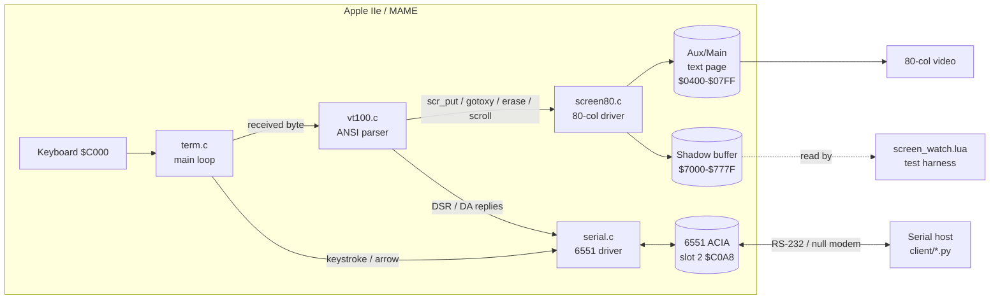

# Architecture

The terminal is split into small modules with one responsibility each. The ANSI
parser talks to the screen only through a thin interface, so it stays free of
Apple-specific details and could be unit-tested against a mock screen.

## Modules and data flow



- **`term.c`** owns the main loop. Each pass: drain the ACIA into the receive
  ring (`serial_pump`), feed one received byte to the parser if any is ready,
  then poll the keyboard and transmit any keystroke.
- **`vt100.c`** is a byte-at-a-time state machine. Printable characters go to the
  screen; escape sequences drive cursor moves, erases, scrolling, and mode
  changes; queries (ESC[6n, ESC[c) are answered back over serial.
- **`screen80.c`** implements the `screen.h` interface against the IIe's
  interleaved 80-column text page, and mirrors every glyph into an off-screen
  **shadow buffer** so tests can read the screen without perturbing it.
- **`serial.c`** drives the 6551, auto-detects the Super Serial Card's slot,
  buffers received bytes in a ring, and applies XON/XOFF flow control.
- **`monitor.s/.h`** is just a registry of hardware addresses (soft switches,
  I/O locations, ROM entry points). It emits no code.
- **`crt0.s`** is the startup shim: set up the cc65 C stack, zero BSS, call
  `start()`, and return to DOS on exit.

## Boot flow

```mermaid
sequenceDiagram
    participant DOS as DOS 3.3
    participant HELLO as HELLO (Applesoft)
    participant CRT0 as crt0.s
    participant TERM as term.c start()
    DOS->>HELLO: run greeting program on boot
    HELLO->>CRT0: BRUN VT100 (loads $0800, JMP $0800)
    CRT0->>CRT0: init C stack, zero BSS
    CRT0->>TERM: jsr _start
    TERM->>TERM: serial_init(); scr_init(); vt100_init()
    TERM->>TERM: draw banner, send "VT100-BOOT\r\n"
    TERM->>TERM: loop: pump serial / feed parser / poll keyboard
```

Making the terminal the DOS 3.3 **greeting program** (via `hello.bas`, which
`BRUN`s the binary) means it starts automatically on both MAME and real
hardware, with no keystroke-timing hacks.

## Memory map

The linker config ([vt100.cfg](../vt100.cfg)) places everything in main RAM
below the cc65 C stack:

| Region | Address | Purpose |
|--------|---------|---------|
| Zero page | `$0080–$009E` | cc65 zero-page (above the monitor's usage) |
| Text page | `$0400–$07FF` | 80-column display (aux = even cols, main = odd) |
| Program | `$0800–$7000` | crt0 + code + rodata + data + bss (loads at `$0800`) |
| **Shadow buffer** | `$7000–$777F` | linear 80×24 copy of the screen (see below) |
| C stack | `$7800–$8000` | 2 KB, grows down from `$8000` |

The program image is a few KB, so the gap between it and the shadow buffer is
large. The shadow buffer lives in that gap — above the linked image top
(`$7000`) and below the stack (`$7800`) — so nothing else ever touches it.

## The shadow buffer

The real 80-column text page is split across two memory banks selected by the
`PAGE2` soft switch (even columns in auxiliary memory, odd columns in main). An
external monitor such as MAME's Lua cannot read both banks without toggling
`PAGE2`, and doing that asynchronously races the running terminal and corrupts
the display.

To make the screen observable without any bank switching, `screen80.c` mirrors
every visible glyph into a plain, linear, **non-banked** buffer at `$7000` (80
bytes per row × 24 rows). Every operation that changes the screen — `scr_put`,
the erases, the scrolls, and the insert/delete operations — updates the shadow
too. The test harness reads `$7000` directly with no side effects. See
[docs/80COLUMN.md](80COLUMN.md) and [docs/TESTING.md](TESTING.md).

## Why cc65 `-Cl` (static locals)

The build uses `-Cl`, which gives functions statically allocated locals instead
of software-stack frames — smaller and faster 6502 code. This is safe because
nothing is reentrant: there are no interrupts and no recursion. See
[docs/HACKING.md](HACKING.md) for the cc65 conventions that matter here.
