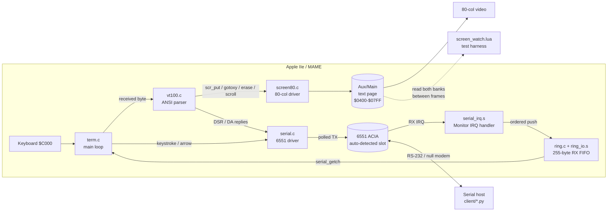

# Architecture

The terminal is split into small modules with one responsibility each. The ANSI
parser talks to the screen only through a thin interface, so it stays free of
Apple-specific details and could be unit-tested against a mock screen.

## Modules and data flow



- **`term.c`** owns the main loop. Each pass services the safe polling
  fallback/XON-XOFF path, feeds one queued byte to the parser, then polls the
  keyboard and transmits any keystroke.
- **`vt100.c`** is a byte-at-a-time state machine. Printable characters go to the
  screen; escape sequences drive cursor moves, erases, scrolling, and mode
  changes; queries (ESC[6n, ESC[c) are answered back over serial.
- **`screen80.c`** implements the `screen.h` interface against the IIe's
  interleaved 80-column text page. Tests read that page directly by toggling
  `PAGE2` from MAME's frame notifier while the CPU is paused between frames.
- **`serial.c`** auto-detects the Super Serial Card, keeps transmit polled, and
  applies XON/XOFF in main context.
- **`serial_irq.s`** patches absolute ACIA operands for the detected slot,
  installs and chains the Monitor IRQ vector, drains RX immediately, serializes
  main-context status reads, and restores the vectors/card on exit or Ctrl-Reset.
- **`ring.c/.h` + `ring_io.s`** provide the sentinel-slot SPSC FIFO. The ISR is
  the sole normal head writer; main is the sole tail writer.
- **`monitor.s/.h`** is just a registry of hardware addresses (soft switches,
  I/O locations, ROM entry points). It emits no code.
- **`crt0.s`** is the startup shim: set up the cc65 C stack, zero BSS, call
  `start()`, disarm RX IRQs, and return to DOS on exit.

## Boot flow

```mermaid
sequenceDiagram
    participant DOS as DOS 3.3
    participant HELLO as HELLO (Applesoft)
    participant CRT0 as crt0.s
    participant TERM as term.c start()
    DOS->>HELLO: run greeting program on boot
    HELLO->>CRT0: BRUN VT100 (loads $0800, JMP $0800)
    CRT0->>CRT0: init C stack, zero BSS
    CRT0->>TERM: jsr _start
    TERM->>TERM: serial_init(); install RX IRQ/reset hook
    TERM->>TERM: scr_init(); vt100_init()
    TERM->>TERM: draw banner, send "VT100-BOOT\r\n"
    TERM->>TERM: loop: service flow control / feed parser / poll keyboard
```

Making the terminal the DOS 3.3 **greeting program** (via `hello.bas`, which
`BRUN`s the binary) means it starts automatically on both MAME and real
hardware, with no keystroke-timing hacks.

## Memory map

The linker config ([vt100.cfg](../vt100.cfg)) places everything in main RAM
below the cc65 C stack:

| Region | Address | Purpose |
|--------|---------|---------|
| Zero page | `$0080–$009E` | cc65 zero-page (above the monitor's usage) |
| Text page | `$0400–$07FF` | 80-column display (aux = even cols, main = odd) |
| Program | `$0800–$6800` | crt0 + code + rodata + data + bss (loads at `$0800`) |
| Alternate screen save | `$6800–$6F7F` | saved 80×24 display bytes |
| Free RAM gap | `$7000–$777F` | unused space below the C stack |
| C stack | `$7800–$8000` | 2 KB, grows down from `$8000` |

The program image loads at `$0800` and leaves a gap below the C stack. The
alternate-screen save area starts at `$6800`; `$7000–$777F` is now just free RAM
in that gap.

`PAGE2` with 80STORE banks only the text page at `$0400-$07FF`. Every object the
IRQ path touches is in code/BSS above `$0800`; `serial_irq.s` carries linker
assertions for the ring, indices, drop counter, and active state. An RX interrupt
can therefore occur while a screen operation has AUX selected without changing
or sampling `PAGE2`.

## IRQ and reset lifecycle

`serial_init()` installs the Ctrl-Reset cleanup hook (`SOFTEV`/`PWREDUP`) before
publishing the Monitor IRQ vector at `IRQLOC`, all under `SEI`, and enables the
6551 receiver interrupt last. The handler follows the Monitor entry contract,
saves the dispatch A/P plus X/Y, handles only the detected SSC, and restores the
exact entry state before jumping to the prior handler for any foreign IRQ.

Both `_exit` and Ctrl-Reset disable RX IRQ, acknowledge the card, restore the
prior IRQ vector and ACIA configuration, then restore the previous soft-reset
vector/check byte. Ctrl-Reset jumps to the saved reset target after cleanup, so
DOS retains its normal reset behavior.

## Reading the video page

The real 80-column text page is split across two memory banks selected by the
`PAGE2` soft switch (even columns in auxiliary memory, odd columns in main).
Most screen operations only write the text page. The few operations that must
read current glyphs — insert/delete characters and alternate-screen save — call
`read_row_glyphs(row, buf)`, which reads one row with two bank switches: even
columns from AUX, odd columns from MAIN.

The external test monitor also reads the real text page. Reading both banks
requires toggling `PAGE2`, so `screen_watch.lua` does it from MAME's machine
frame notifier, where the CPU is paused between frames. It reads MAIN and AUX,
restores the terminal's `PAGE2` state, and therefore does not race the running
terminal. See [docs/80COLUMN.md](80COLUMN.md) and [docs/TESTING.md](TESTING.md).

## Why cc65 `-Cl` (static locals)

The build uses `-Cl`, which gives functions statically allocated locals instead
of software-stack frames — smaller and faster 6502 code. C remains
non-reentrant: the pure-assembly RX handler calls only the assembly ring
producer and never enters C or the cc65 runtime. Recursion is still forbidden.
See [HACKING.md](HACKING.md) for the cc65 conventions that matter here.
