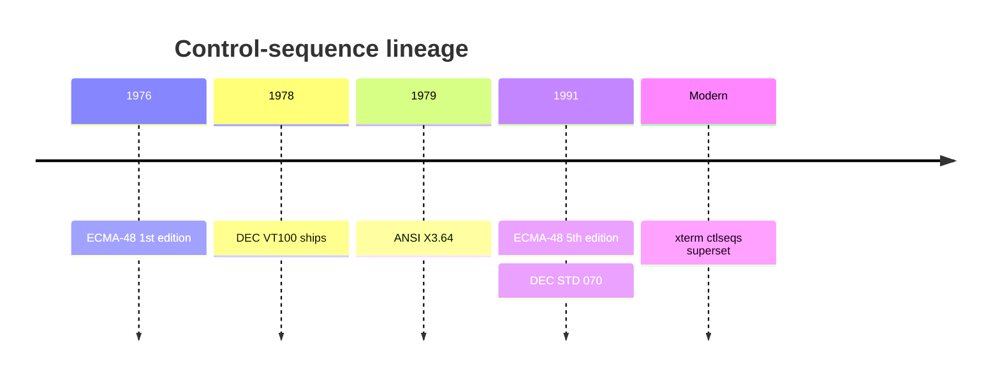
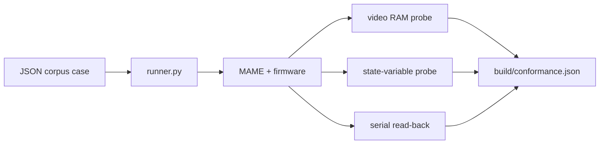
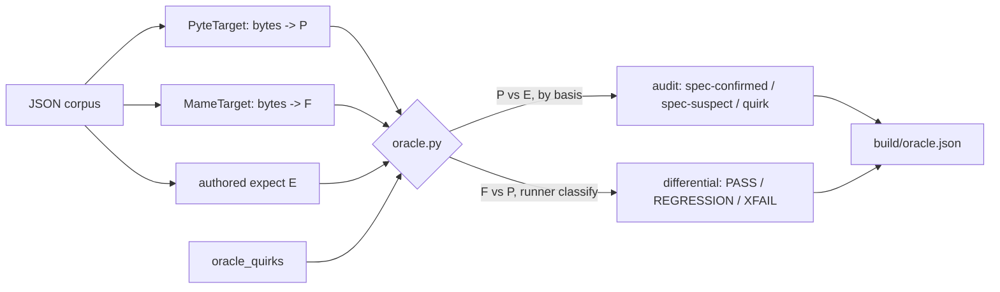

# Terminal conformance

This project builds a spec-derived, implementation-decoupled conformance corpus
for the VT100/ECMA-48 feature space. It measures what the firmware implements,
tracks features not yet supported as xfail, and lets a conformance percentage
trend upward over time. See [docs/TERMINAL.md](TERMINAL.md) for the implemented
subset and [docs/TESTING.md](TESTING.md) for the existing harnesses.

## The standards, and how they layer

ECMA-48 is the **language**; the VT100 is an early **dialect** that implemented a
subset plus its own words. The firmware advertises `TERM=vt100`, so the VT100
manual is the baseline contract. Real Unix apps (`bash` line editing, `vi`,
`less`, `ncurses`) freely emit ECMA-48 functions and xterm extensions, so the
target is layered.

| Layer | What it is | Governs (examples) | How a corpus case cites it in its `spec_ref` field |
|-------|------------|--------------------|----------------------------------------------------|
| ECMA-48 / ANSI X3.64 / ISO/IEC 6429 | Abstract, device-independent control-function standard; first edition 1976, 5th edition 1991 | C0/C1 controls; ESC / CSI (`ESC [`) / DCS / OSC / ST structure; CUU/CUD/CUF/CUB, CUP/HVP, CHA/HPA/VPA, ED/EL, ICH/DCH/ECH/IL/DL, SGR, IRM, DSR, SM/RM | `ECMA-48 §8.3.x` |
| DEC VT100 / VT220 + DEC STD 070 | Concrete DEC terminals and DEC's video-system behavior | 24x80/132 screen; US ASCII + DEC Special Graphics; keyboard; reports; DEC-private modes `?1`, `?6`, `?7`, `?25`; DECSTBM, DECSC/DECRC, SCS, RIS, primary DA `ESC[?1;0c` | `VT100-UG §3` / `VT220-RM` |
| xterm ctlseqs | De-facto modern superset: ECMA-48 + DEC VT220-VT520 + xterm extensions | Alt screen `?1047`/`?1049`; OSC titles; DCS; 256/truecolor SGR; mouse; bracketed paste | `ctlseqs: <feature>` |



ECMA-48 defines the grammar and vocabulary: C0/C1 controls; ESC, CSI, DCS, OSC,
ST framing; and a catalogue of parameterized control functions with defaults. It
is harmonised with ANSI X3.64 and ISO/IEC 6429 — three names, effectively one
standard, colloquially "ANSI escape codes".

The VT100 manual defines a specific device: screen geometry, sequence repertoire,
character sets, keyboard, reports, and DEC-private features. DEC extensions live
in the private-use space ECMA-48 reserves with the `?` marker: DECCKM `?1`, DECOM
`?6`, DECAWM `?7`, DECTCEM `?25`, plus DECSTBM (`ESC[r`), DECSC/DECRC (`ESC 7` /
`ESC 8` and `ESC[s` / `ESC[u`), SCS (`ESC(0`), RIS, and primary DA
`ESC[?1;0c`.

## External test suites

| Suite | What it is | Role here |
|-------|------------|-----------|
| vttest (Thomas Dickey, Invisible Island) | Interactive/visual VT100..VT520 + xterm tester; a human eyeballs the screen | Not automatable against headless firmware. Use as a **catalog** of cases and categories to include. |
| esctest2 (George Nachman + Thomas Dickey) | Python, data-driven, fully automatic; asserts via cursor-position reports, DECRQCRA rectangle checksums, and screen rectangle reads; tracks per-terminal known bugs with `knownBug` (xfail) | **Architectural template**: declarative cases, machine assertions, xfail. Mine its category list. Do not run directly: it drives a terminal over a pty and relies on DECRQCRA, which this firmware does not implement. |
| pyte / libvterm / real xterm | Executable reference emulators that can generate expected screens | **pyte is implemented** as an independent differential oracle — see [Reference-oracle differential testing](#reference-oracle-differential-testing) below. libvterm / xterm remain optional future references. |

## How we grade — automated probes, no human review

Expected values are authored from the spec and committed as data. Every case is
checked by machine; no human eyeballing, and no reference emulator in the MAME runner.

| Channel | Mechanism | Asserts |
|---------|-----------|---------|
| Video-RAM probe | MAME Lua reads the Apple's 80-column video page directly (`client/conformance/probes/screen_watch.lua`) | Glyph plane and inverse-attribute plane. Inverse is detectable because the firmware stores inverse glyphs as video bytes `< 0x80`. This is what proves an attribute does not leak — e.g. the `alt-screen` cases assert text after an `ESC[?1049l` alt-screen exit renders normal, not inverse. [docs/TESTING.md](TESTING.md) describes the current screen dumper. |
| State-variable probe | MAME Lua reads firmware globals from RAM using addresses from the linker label file | Cursor row/col, current attribute, scroll region, DEC mode flags; useful for modes that parse but do not yet affect rendering. A case can also assert the parser's `attr_inverse` flag directly — e.g. that it is cleared after an alt-screen round trip. |
| Wire read-back | The terminal's own replies over the serial socket | Cursor position report (`ESC[6n` → `ESC[row;colR`), device status (`ESC[5n` → `ESC[0n`), device attributes (`ESC[c` → `ESC[?1;0c`). Report bytes are matched **exactly**, not by containment, so a doubled or malformed reply fails; the only allowance is that a non-CPR expected reply may strip one trailing readiness CPR. To keep the read-back clean, `MameTarget` sends a render window that already ends in the case's own report query raw, without appending its `ESC[6n` pacing probe. (That probe and its cursor-report reply are the windowed readiness handshake — see [PROTOCOL.md §4](PROTOCOL.md) for what DSR is and why the harness paces on it; appending it after a case's *own* query would double the reply and could leave a stray report byte on the glyph plane.) |



Compared with esctest2, MAME Lua gives a near-perfect read-back channel: it can
read video RAM and firmware state directly, so the corpus can assert screen
contents even for sequences the firmware provides no report for. No DECRQCRA is
needed.

## Corpus format and status/xfail model

Each case is a JSON record stored per category under
`client/conformance/corpus/`:

```json
{ "id": "...", "category": "...", "spec_ref": "...", "input": "...", "status": "supported", "basis": "spec", "expect": {}, "notes": "..." }
```

Two orthogonal fields describe a case. `status` (`supported` | `partial` |
`unsupported`) drives the **pass/fail** classification. `basis` (default `spec`)
drives how a pass is **counted** — see the next section. Keeping them separate is
deliberate: it stops a relabel from silently moving the headline number.

| Declared status | Expectations met | Outcome |
|-----------------|------------------|---------|
| `supported` | yes | PASS |
| `supported` | no | REGRESSION; fails CI |
| `partial` / `unsupported` | no | XFAIL; expected gap |
| `partial` / `unsupported` | yes | UNEXPECTED PASS; needs review (see below) |
| (`basis: unobservable`, any status) | — | SKIP; never scored |

### Why a pass is not enough: the `basis` axis

A single `status=supported` was being used to mean four different things: "we
implement this per spec", "we safely ignore this", "this happens to match our
default", and "we can't even see this". Collapsing them makes the conformance
percentage move when a case is *relabelled* rather than when *behaviour* changes —
the metric stops tracking the firmware. `basis` records **what a pass actually
proves** so each case lands in an honest bucket:

| `basis` | Meaning | Counts toward |
|---------|---------|---------------|
| `spec` | Strict VT100/ECMA-48 behaviour a conformant reference terminal would also produce. Real conformance (or, if unsupported, a clean XFAIL). | spec + profile + behavioural |
| `profile` | A **visible**, ECMA-permitted, documented Apple IIe degradation a reference terminal would *not* produce (DEC line-draw → ASCII fold). | profile + behavioural |
| `tolerance` | An unimplemented sequence **absorbed as an observable no-op** in this context (bold/underline/colour consumed; SO/SI with the default G1). Proves "does not corrupt", not "implements". | behavioural |
| `degenerate` | Passes **only because a firmware default coincides** with the tested direction (a mode's reset direction while the mode is ignored; selective erase while no cell is DECSCA-protected). Does not prove the feature. | behavioural |
| `unobservable` | The real effect cannot be probed (DECTCEM cursor visibility). Scored **SKIP** so an untestable claim is never counted as conformance. | nothing (SKIP) |

The rule for `spec` vs `profile`: would a strict reference terminal pass this
exact `expect`? If yes it is `spec` (we may be under-asserting, but we are not
claiming a degradation); if the expected value encodes an IIe-only visible
substitution the reference would fail, it is `profile`.

### Metrics

All percentages are computed over explicit case subsets, never over the raw
outcome tally, so each number has one unambiguous meaning. `unobservable` cases
are excluded everywhere (they are SKIP).

| Metric | Definition | Answers |
|--------|------------|---------|
| **Behavioural compatibility** | `(PASS + UNEXPECTED_PASS) / scored cases` | Did the firmware produce the correct *observable* behaviour, regardless of label? **Relabel-invariant** — the honest headline. |
| **Spec conformance** | `PASS / checkable` among `basis = spec` | How much strict VT100/ECMA-48 do we conform to, hardware-independent? |
| **Profile conformance** | `PASS / checkable` among `basis ∈ {spec, profile}` | …including the documented IIe rendering degradations. |
| **Completeness** | `supported-checkable / scored cases` | How much of the corpus do we *claim* to support? |
| **Correctness** | `PASS / supported-checkable` | Are those `supported` claims actually true? (A gap here is a REGRESSION.) |

Behavioural compatibility is the metric to watch: because it counts PASS and
UNEXPECTED_PASS together, promoting a case from `unsupported` to `supported` moves
it between those two buckets without changing the number — the figure tracks the
firmware's behaviour, not the corpus bookkeeping. Spec and profile conformance
*do* move on a promotion, which is correct: they become more truthful as a real
gap closes.

### Promoting an UNEXPECTED PASS (no auto-flip)

An UNEXPECTED PASS is a prompt to investigate, **not** a signal to flip the label
automatically. A pass can be real progress *or* a check that passes for the wrong
reason (a `degenerate` default coincidence, or a `tolerance` no-op). Before
changing `status` to `supported`:

1. Confirm the pass is caused by the feature, not a default or an unobservable
   effect — add a **discriminating companion case** that would fail if the feature
   were absent (e.g. pair a mode's reset direction with its set direction; pair a
   selective erase with a DECSCA-protected cell once DECSCA is implemented).
2. Set an honest `basis` (`spec` only if a reference terminal would pass the same
   `expect`; otherwise `profile` / `tolerance` / `degenerate`).
3. Only then flip `status`, so the promotion reflects proven behaviour.

The runner is `client/conformance/runner.py`; it emits `build/conformance.json`
with every metric above plus a per-`basis` count. It exits nonzero on any
REGRESSION or ERROR; `--strict` additionally fails on UNEXPECTED PASS to force the
review. In CI this runs in the **`mame-conformance` job**, against the real Apple IIe
ROMs with the pinned cc65/MAME toolchain; see
[docs/TESTING.md](TESTING.md#continuous-integration--reproducible-toolchain).

## Reference-oracle differential testing

The authored `expect` values are the human-curated truth, but the same team wrote the
firmware *and* the expectations, so a shared misreading of the spec would be invisible to
the conformance runner. An **independent oracle** is added:
[pyte](https://github.com/selectel/pyte), a pure-Python ECMA-48 screen model with no
knowledge of our firmware or our authored expectations. It plugs in as another render
target (`client/conformance/target_pyte.py`, behind the same `render(bytes) -> Screen`
interface from `target_base.py`) and is driven by a separate entry point,
`client/conformance/oracle.py`, so it never edits the MAME runner.

For a case there are up to three screens: **E** (authored `expect`), **F** (firmware, via
MAME) and **P** (pyte). That yields two comparisons on top of the runner's F-vs-E:

| Comparison | Question | Needs MAME? | How |
|-----------|----------|-------------|-----|
| **P vs E** (audit) | Does an independent reference satisfy our authored expectations? | no | `python oracle.py --audit` (default) |
| **F vs P** (differential) | Does the firmware agree with an independent reference, cell for cell? | yes | `python oracle.py --differential` |

### P-vs-E audit (MAME-free)

The audit needs neither MAME nor the firmware — only the corpus and `model.py` — so it
runs anywhere and can gate every push. It runs `check(P, expect)` for each observable case
and reads the verdict **through the case's `basis`**, because that fixes what a
disagreement means:

| `basis` | pyte satisfies `expect` | pyte disagrees |
|---------|-------------------------|----------------|
| `spec` | `spec-confirmed` — an independent spec-follower backs the golden | `spec-suspect` — a corpus bug *or* a firmware/spec question |
| `profile` / `tolerance` / `degenerate` | `…-ok` — the reference agrees where it can | folded to a pyte-quirk when pyte itself is the outlier |
| `unobservable` | `skip-unobservable` — never scored | — |

The headline is **reference agreement** = `spec-confirmed / (spec-confirmed +
spec-suspect)`: of the strict-spec cases pyte can actually judge, how many an independent
reference confirms. A `spec-suspect` is the valuable output — either a mis-authored case or
a genuine firmware/spec divergence — and each is triaged by hand.

### F-vs-P differential

The differential reuses runner.py's classifier verbatim: it renders **F** (MAME) and
**P** (pyte), diffs the glyph + inverse + cursor planes with `diff_screens`, and feeds the
result through the same `classify` / `summarize` that `runner.py` uses, so a divergence is
labelled with the identical PASS / REGRESSION / XFAIL / UNEXPECTED-PASS / SKIP vocabulary
and counted by the same `basis`-aware metrics. A `supported`/`spec` case where F and P
disagree is a **REGRESSION**; an `unsupported` case where they agree is an **UNEXPECTED
PASS** — exactly as in the authored-expect run, but judged against an independent reference
instead of our own goldens.

### pyte is not infallible

Where pyte itself is wrong or incomplete, its verdict is discarded via
`client/conformance/oracle_quirks.py` rather than raising a false regression. Catalogued
pyte 0.8.2 quirks: NEL (`ESC E`) indexes without a carriage return; HPA (`` CSI ` ``) and
SU/SD (`CSI S` / `CSI T`) unimplemented; SCOSC/SCORC (`CSI s` / `CSI u`) unimplemented; DCS
strings render their payload instead of consuming it; tertiary DA (`CSI = c`) prints its `c`
final byte instead of being consumed; DEC Special Graphics and alt-screen.
Two channels are structurally invisible to pyte and handled through `Capabilities`
(`reports=False, state=False`): the **wire `report` channel** (DSR/DA/DECRQSS replies) and
**firmware state variables**. pyte can never oracle a case's `report` assertion, so
`checkable_expect` drops it — but the differential no longer blanket-skips report cases.
Previously the MAME harness appended its own `ESC[6n` probe to *every* render;
back-to-back with a case's own DSR that doubled query could leave a stray report-final byte
on the firmware glyph plane, an artifact the case's real (single-query) bytes never produce
and pyte never sees, so a screen diff was not a valid oracle. That contamination is now
fixed (`MameTarget._send` sends a final window that already ends in the case's own query
raw, without the probe), so a report case that **also** asserts a pyte-observable plane —
e.g. the cursor of a CPR case (`ESC[8;20H ESC[6n`) — grades on that glyph/inverse/cursor
diff like any other case, with only its wire `report` key dropped. Pure wire-only report
cases (bare `ESC[5n`, `ESC[c`, DECRQM, DECRQSS) have nothing pyte can observe and still SKIP
via the normal not-checkable path.

### What the first run found

- **Reference agreement at the first oracle run: 98.5%** (131/133 strict-spec cases);
  the two `spec-suspect`s were the firmware/spec question below (the ED/DECSED cursor
  homing, now **fixed** — see the next bullet) and one mis-authored terminator. After the
  ED/DECSED fix plus the two new guard cases, the current audit agreement is **133/134**,
  with only the terminator case (`osc-title-st-following-text`) still outstanding.
- **Differential: 3 REGRESSIONs, all one root cause** — the firmware homed the cursor to
  (1,1) on erase-all (`ED` / `DECSED` with parameter `2`), while ECMA-48 §8.3.39 (ED) does
  not move the cursor and pyte leaves it put. This was a genuine firmware/spec
  non-conformance, not a rendering dialect: ECMA-48 does **not** permit ED to move the
  cursor, so it could not simply be relabelled `basis: profile` (which is reserved for
  ECMA-*permitted* visible degradations). **Resolved:** the firmware now erases
  the display in place and leaves the active position where it was — the `J` ED/DECSED
  param-2 path restores the cursor after the shared `scr_clear_all()` (which still homes
  for RIS/init/alt-screen). The three affected cases (`cur-vt100-clear-homes`,
  `erase-ed-two-all`, `erase-decsed-two-all`) now assert the unchanged cursor, and the
  dedicated positive-assertion cases `erase-ed-two-keeps-cursor` /
  `erase-decsed-two-keeps-cursor` guard the invariant; `cur-vt100-clear-homes` has left the
  `spec-suspect` list (current reference agreement 133/134).
- **A corpus authoring bug** — `osc-title-st-following-text` (and, masked by a DCS quirk,
  `dcs-following-text-position`) encoded the ST terminator so `model.decode` dropped a byte
  when literal text followed; the fix is to encode ST as `\x1b\x5c`. This is now handled
  correctly by the OSC/DCS consume states, which also promote those cases (and secondary DA)
  from xfail to `supported`.


Design note: pyte **augments**, it does not replace. The original proposal's literal "generate the
`expected` field from pyte" is deliberately rejected — that would discard the curated
corpus and inherit pyte's quirks. The differential is structured around a single
`PyteTarget` today, but the diff/classify path is target-agnostic, so a second reference
(libvterm / xterm) can be added later as a drop-in cross-check.



## References

- ECMA-48 5th edition: https://ecma-international.org/publications-and-standards/standards/ecma-48/
- XTerm Control Sequences (ctlseqs): https://invisible-island.net/xterm/ctlseqs/ctlseqs.html
- DEC VT100 User Guide: https://vt100.net/docs/vt100-ug/
- DEC VT510 Video Terminal Programmer Information: https://vt100.net/docs/vt510-rm/
- DEC STD 070 (Video Systems Reference Manual, 1991) — via bitsavers
- vttest: https://invisible-island.net/vttest/vttest.html
- esctest2: https://github.com/ThomasDickey/esctest2
- pyte (independent oracle): https://github.com/selectel/pyte
