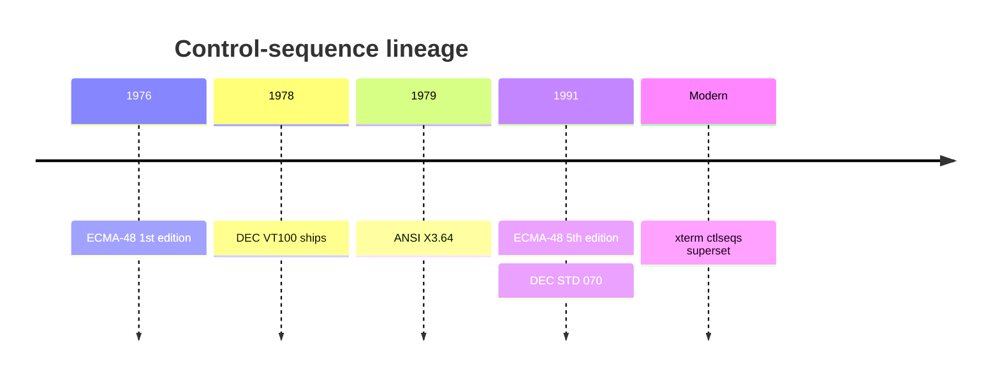
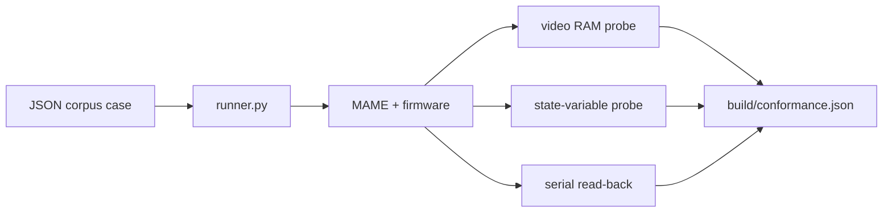

# Terminal conformance

This project builds a spec-derived, implementation-decoupled conformance corpus
for the VT100/ECMA-48 feature space. It measures what the firmware implements,
tracks features not yet supported as xfail, and lets a conformance percentage
trend upward over time. See [docs/TERMINAL.md](TERMINAL.md) for the implemented
subset and [docs/TESTING.md](TESTING.md) for the existing harnesses.

## The standards, and how they layer

ECMA-48 is the **language**; the VT100 is an early **dialect** that implemented a
subset plus its own words. The firmware advertises `TERM=vt100`, so the VT100
manual is the baseline contract. Real Unix apps (`bash` line editing, `vi`,
`less`, `ncurses`) freely emit ECMA-48 functions and xterm extensions, so the
target is layered.

| Layer | What it is | Governs (examples) | How a corpus case cites it in its `spec_ref` field |
|-------|------------|--------------------|----------------------------------------------------|
| ECMA-48 / ANSI X3.64 / ISO/IEC 6429 | Abstract, device-independent control-function standard; first edition 1976, 5th edition 1991 | C0/C1 controls; ESC / CSI (`ESC [`) / DCS / OSC / ST structure; CUU/CUD/CUF/CUB, CUP/HVP, CHA/HPA/VPA, ED/EL, ICH/DCH/ECH/IL/DL, SGR, IRM, DSR, SM/RM | `ECMA-48 §8.3.x` |
| DEC VT100 / VT220 + DEC STD 070 | Concrete DEC terminals and DEC's video-system behavior | 24x80/132 screen; US ASCII + DEC Special Graphics; keyboard; reports; DEC-private modes `?1`, `?6`, `?7`, `?25`; DECSTBM, DECSC/DECRC, SCS, RIS, primary DA `ESC[?1;0c` | `VT100-UG §3` / `VT220-RM` |
| xterm ctlseqs | De-facto modern superset: ECMA-48 + DEC VT220-VT520 + xterm extensions | Alt screen `?1047`/`?1049`; OSC titles; DCS; 256/truecolor SGR; mouse; bracketed paste | `ctlseqs: <feature>` |



ECMA-48 defines the grammar and vocabulary: C0/C1 controls; ESC, CSI, DCS, OSC,
ST framing; and a catalogue of parameterized control functions with defaults. It
is harmonised with ANSI X3.64 and ISO/IEC 6429 — three names, effectively one
standard, colloquially "ANSI escape codes".

The VT100 manual defines a specific device: screen geometry, sequence repertoire,
character sets, keyboard, reports, and DEC-private features. DEC extensions live
in the private-use space ECMA-48 reserves with the `?` marker: DECCKM `?1`, DECOM
`?6`, DECAWM `?7`, DECTCEM `?25`, plus DECSTBM (`ESC[r`), DECSC/DECRC (`ESC 7` /
`ESC 8` and `ESC[s` / `ESC[u`), SCS (`ESC(0`), RIS, and primary DA
`ESC[?1;0c`.

## External test suites

| Suite | What it is | Role here |
|-------|------------|-----------|
| vttest (Thomas Dickey, Invisible Island) | Interactive/visual VT100..VT520 + xterm tester; a human eyeballs the screen | Not automatable against headless firmware. Use as a **catalog** of cases and categories to include. |
| esctest2 (George Nachman + Thomas Dickey) | Python, data-driven, fully automatic; asserts via cursor-position reports, DECRQCRA rectangle checksums, and screen rectangle reads; tracks per-terminal known bugs with `knownBug` (xfail) | **Architectural template**: declarative cases, machine assertions, xfail. Mine its category list. Do not run directly: it drives a terminal over a pty and relies on DECRQCRA, which this firmware does not implement. |
| pyte / libvterm / real xterm | Executable reference emulators that can generate expected screens | Deferred to issue #18 as a differential oracle. Not used in #13. |

## How we grade — automated probes, no human review

Expected values are authored from the spec and committed as data. Every case is
checked by machine; no human eyeballing, and no reference emulator in #13.

| Channel | Mechanism | Asserts |
|---------|-----------|---------|
| Video-RAM probe | MAME Lua reads the Apple's 80-column video page directly (`client/conformance/probes/screen_watch.lua`) | Glyph plane and inverse-attribute plane. Inverse is detectable because the firmware stores inverse glyphs as video bytes `< 0x80`. [docs/TESTING.md](TESTING.md) describes the current screen dumper. |
| State-variable probe | MAME Lua reads firmware globals from RAM using addresses from the linker label file | Cursor row/col, current attribute, scroll region, DEC mode flags; useful for modes that parse but do not yet affect rendering. |
| Wire read-back | The terminal's own replies over the serial socket | Cursor position report (`ESC[6n` → `ESC[row;colR`), device status (`ESC[5n` → `ESC[0n`), device attributes (`ESC[c` → `ESC[?1;0c`). |



Compared with esctest2, MAME Lua gives a near-perfect read-back channel: it can
read video RAM and firmware state directly, so the corpus can assert screen
contents even for sequences the firmware provides no report for. No DECRQCRA is
needed.

## Corpus format and status/xfail model

Each case is a JSON record stored per category under
`client/conformance/corpus/`:

```json
{ "id": "...", "category": "...", "spec_ref": "...", "input": "...", "status": "supported", "basis": "spec", "expect": {}, "notes": "..." }
```

Two orthogonal fields describe a case. `status` (`supported` | `partial` |
`unsupported`) drives the **pass/fail** classification. `basis` (default `spec`)
drives how a pass is **counted** — see the next section. Keeping them separate is
deliberate: it stops a relabel from silently moving the headline number.

| Declared status | Expectations met | Outcome |
|-----------------|------------------|---------|
| `supported` | yes | PASS |
| `supported` | no | REGRESSION; fails CI |
| `partial` / `unsupported` | no | XFAIL; expected gap |
| `partial` / `unsupported` | yes | UNEXPECTED PASS; needs review (see below) |
| (`basis: unobservable`, any status) | — | SKIP; never scored |

### Why a pass is not enough: the `basis` axis

A single `status=supported` was being used to mean four different things: "we
implement this per spec", "we safely ignore this", "this happens to match our
default", and "we can't even see this". Collapsing them makes the conformance
percentage move when a case is *relabelled* rather than when *behaviour* changes —
the metric stops tracking the firmware. `basis` records **what a pass actually
proves** so each case lands in an honest bucket:

| `basis` | Meaning | Counts toward |
|---------|---------|---------------|
| `spec` | Strict VT100/ECMA-48 behaviour a conformant reference terminal would also produce. Real conformance (or, if unsupported, a clean XFAIL). | spec + profile + behavioural |
| `profile` | A **visible**, ECMA-permitted, documented Apple IIe degradation a reference terminal would *not* produce (DEC line-draw → ASCII fold, issue #12). | profile + behavioural |
| `tolerance` | An unimplemented sequence **absorbed as an observable no-op** in this context (bold/underline/colour consumed; SO/SI with the default G1). Proves "does not corrupt", not "implements". | behavioural |
| `degenerate` | Passes **only because a firmware default coincides** with the tested direction (a mode's reset direction while the mode is ignored; selective erase while no cell is DECSCA-protected). Does not prove the feature. | behavioural |
| `unobservable` | The real effect cannot be probed (DECTCEM cursor visibility). Scored **SKIP** so an untestable claim is never counted as conformance. | nothing (SKIP) |

The rule for `spec` vs `profile`: would a strict reference terminal pass this
exact `expect`? If yes it is `spec` (we may be under-asserting, but we are not
claiming a degradation); if the expected value encodes an IIe-only visible
substitution the reference would fail, it is `profile`.

### Metrics

All percentages are computed over explicit case subsets, never over the raw
outcome tally, so each number has one unambiguous meaning. `unobservable` cases
are excluded everywhere (they are SKIP).

| Metric | Definition | Answers |
|--------|------------|---------|
| **Behavioural compatibility** | `(PASS + UNEXPECTED_PASS) / scored cases` | Did the firmware produce the correct *observable* behaviour, regardless of label? **Relabel-invariant** — the honest headline. |
| **Spec conformance** | `PASS / checkable` among `basis = spec` | How much strict VT100/ECMA-48 do we conform to, hardware-independent? |
| **Profile conformance** | `PASS / checkable` among `basis ∈ {spec, profile}` | …including the documented IIe rendering degradations. |
| **Completeness** | `supported-checkable / scored cases` | How much of the corpus do we *claim* to support? |
| **Correctness** | `PASS / supported-checkable` | Are those `supported` claims actually true? (A gap here is a REGRESSION.) |

Behavioural compatibility is the metric to watch: because it counts PASS and
UNEXPECTED_PASS together, promoting a case from `unsupported` to `supported` moves
it between those two buckets without changing the number — the figure tracks the
firmware's behaviour, not the corpus bookkeeping. Spec and profile conformance
*do* move on a promotion, which is correct: they become more truthful as a real
gap closes.

### Promoting an UNEXPECTED PASS (no auto-flip)

An UNEXPECTED PASS is a prompt to investigate, **not** a signal to flip the label
automatically. A pass can be real progress *or* a check that passes for the wrong
reason (a `degenerate` default coincidence, or a `tolerance` no-op). Before
changing `status` to `supported`:

1. Confirm the pass is caused by the feature, not a default or an unobservable
   effect — add a **discriminating companion case** that would fail if the feature
   were absent (e.g. pair a mode's reset direction with its set direction; pair a
   selective erase with a DECSCA-protected cell once DECSCA is implemented).
2. Set an honest `basis` (`spec` only if a reference terminal would pass the same
   `expect`; otherwise `profile` / `tolerance` / `degenerate`).
3. Only then flip `status`, so the promotion reflects proven behaviour.

The runner is `client/conformance/runner.py`; it emits `build/conformance.json`
with every metric above plus a per-`basis` count. It exits nonzero on any
REGRESSION or ERROR; `--strict` additionally fails on UNEXPECTED PASS to force the
review.

## References

- ECMA-48 5th edition: https://ecma-international.org/publications-and-standards/standards/ecma-48/
- XTerm Control Sequences (ctlseqs): https://invisible-island.net/xterm/ctlseqs/ctlseqs.html
- DEC VT100 User Guide: https://vt100.net/docs/vt100-ug/
- DEC VT510 Video Terminal Programmer Information: https://vt100.net/docs/vt510-rm/
- DEC STD 070 (Video Systems Reference Manual, 1991) — via bitsavers
- vttest: https://invisible-island.net/vttest/vttest.html
- esctest2: https://github.com/ThomasDickey/esctest2
- pyte (future oracle, #18): https://github.com/selectel/pyte
