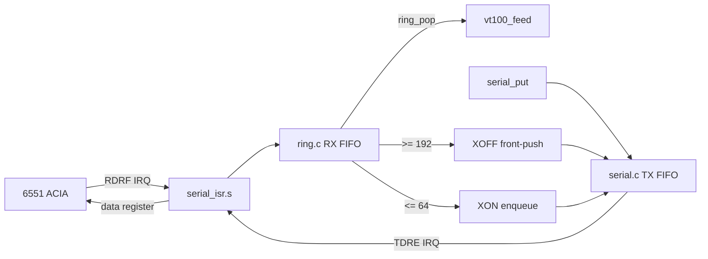

# Serial I/O (6551 ACIA)

[serial.c](../serial.c), [ring.c](../ring.c), and
[serial_isr.s](../serial_isr.s) form the interrupt-driven 6551 ACIA driver for
the Super Serial Card at **9600 baud, 8N1**. The driver auto-detects the card's
slot, services RX and TX from one assembly IRQ handler, and uses XON/XOFF to
bound the receive ring while the Apple is busy drawing.

## Registers

The 6551's four registers sit at `$C088 + slot*16`:

| Offset | Register | Notes |
|--------|----------|-------|
| `+0` | Data | Read = received byte; write = transmit byte |
| `+1` | Status | RDRF (`0x08`) = receive full; TDRE (`0x10`) = transmit empty; write = reset |
| `+2` | Command | `0x09` = RX IRQ on/TX IRQ off; `0x05` = RX + TX IRQs on; `0x0A` = teardown with DTR deasserted |
| `+3` | Control | `0x1E` = 9600 baud, 8 data bits, 1 stop bit |

The register pointer is declared **`volatile`** — these are memory-mapped I/O
locations, so every access must be a real bus cycle and must not be optimized or
cached by the compiler. Forgetting `volatile` here is a classic and confusing
bug (see [docs/LESSONS.md](LESSONS.md)).

TDR writes are the exception to using that dynamic pointer directly. cc65 emits
`STA (zp),Y` for an indirect write, and the NMOS 6502 dummy-reads the destination
before the write. A dummy read of the data register consumes RDR, so the assembly
TX path must use a slot-specific absolute store.

```c
static volatile unsigned char *acia = (volatile unsigned char *)0xC0A8; /* slot 2 */
```

## Slot auto-detection

Rather than hardcode slot 2, `serial_init()` scans slots 7→1 for the Super Serial
Card's firmware signature (the Pascal 1.1 protocol bytes ADTPro's `FindSlot`
looks for):

```
$Cn05 == $38   $Cn07 == $18   $Cn0B == $01   $Cn0C == $31
```

The first match sets `acia = $C088 + slot*16`. If nothing matches it falls back
to slot 2 (`$C0A8`), which is where MAME wires the card.

## Interrupt-driven RX and TX



The 6551 has one IRQ output for both directions. The handler services RDRF
before an enabled TDRE source and re-samples status after service so a source
that became pending during the first pass is not stranded:

- **RX:** `serial_isr.s` reads the one-byte hardware register immediately and
  publishes the byte to the receive FIFO. `ring.c` owns the 256-byte array and
  its pointer operations; `r_head` is written only by the ISR and `r_tail` only
  by the main loop. One sentinel slot distinguishes full from empty, so capacity
  is 255 bytes and occupancy is `(unsigned char)(r_head - r_tail)`.
- **TX:** `serial_put()` appends one byte to a second 256-byte FIFO.
  `serial_write()` publishes a complete short protocol reply before arming an
  idle transmitter. `tx_irq_active` is explicit state: the first enqueue writes
  command `0x05` once, later enqueues do not rewrite it, and the first empty
  TDRE writes `0x09` once. Otherwise TDRE would assert continuously, and
  redundant command writes needlessly restart MAME's emulated divider.
- **Full rings:** RX drains the ACIA and drops the newest byte if the host has
  ignored XOFF long enough to fill all 255 slots. TX waits only when its 255
  slots are occupied, re-enabling interrupts between retries so the ISR can
  make space.

Both indices in each FIFO are byte-sized and asynchronous indices are
`volatile`. RX is lock-free because it has exactly one producer and one consumer.
TX has one extra wrinkle: the ISR can inject urgent XOFF at the *front* while
main appends at the back. `serial_put()` therefore masks IRQs for the short
capacity-check/store/head-publish sequence. This prevents both sides claiming
the final sentinel-adjacent slot and collapsing a full queue into `head == tail`.

### Why TX uses a patched absolute store

Do not replace the ISR's patched `STA $ffff` with `STA (aciap),Y`. A 6502
indexed-indirect store performs a dummy read before the write. At ACIA DATA that
read is destructive: if RX completes after the status sample, the dummy read
clears RDRF and consumes the byte without publishing it to the ring. The install
routine patches the absolute operand to the detected SSC slot, so TX performs
only the intended write bus cycle. The DA-followed-by-private-CSI regression and
the stress harness's exact RX publication trace guard this instruction-level
requirement.

## XON/XOFF priority

- At RX occupancy **192**, the ISR decrements `t_tail`, stores **XOFF** there, and
  arms TX IRQ. This front-push makes XOFF the next transmitted byte even when
  ordinary replies are already queued.
- Once main drains RX to **64**, `serial_getch()` clears the throttled state and
  appends **XON** normally. XON need not jump queued output because the host is
  already stopped.

### Receive loss while replying

The 6551 is **full duplex** at the shift-register level, but it buffers only one
received byte in RDR. The old synchronous reply path could leave it unserviced
while polling TX or formatting a CPR. Interrupt-driven RX removes those main-loop
gaps, division-free coordinate formatting bounds report latency, and queued TX
publishes complete replies before an idle transmitter is armed.

An independent hardware hazard remains even with IRQ service: an NMOS 6502
`STA (zp),Y` performs a dummy read of its destination before writing. Against the
ACIA data register that read consumes RDR and clears receive status. The TX ISR
therefore must write TDR with a slot-specific absolute `STA`.

Two ROM-backed corpus cases guard the result:

- `report-da-overlap-lossless` packs seven `DA -> private CSI -> marker` groups
  into one transport window and requires all seven replies, all marker bytes, and
  no literal CSI residue.
- `report-cpr-6n-idempotent` requires two exact CPR replies and unchanged RAM
  cursor state for back-to-back `ESC[6n`, closing issue #24.

The host must honor XON/XOFF. A host that ignores XOFF can still overflow the
software ring, but rendering or reply generation can no longer overrun the
6551's one-byte RDR merely because main was busy.

## IRQ and PAGE2 contract

The Apple IIe ROM IRQ path saves A at `$45` and jumps through the user vector at
`$03FE`. `serial_isr_install()` saves the predecessor, publishes the
slot-detected ACIA pointer, installs the new vector, writes command `0x09`, and
enables CPU interrupts. The pure-assembly handler saves/restores P, X, and Y,
restores A from `$45`, calls no C, and returns with `RTI`. If an IRQ has no ACIA
source, it restores the entry contract and chains to the saved vector.

Calling C from the ISR is forbidden: the build uses cc65 `-Cl`, whose static
locals and runtime zero-page temporaries are not reentrant. The ISR owns four
zero-page bytes (`aciap`, `sr_tmp`, and `irq_owned`) and touches only the ACIA
plus ring storage.
The rings are in BSS above `$0800`, outside the `$0400-$07FF` text window, so the
handler neither reads nor changes `PAGE2`. If it interrupts `cell_put()` while
AUX is selected, the render resumes with the same bank selected.

If `start()` returns, crt0 calls `serial_isr_remove()` before the DOS warm start.
Teardown masks CPU IRQs, deasserts DTR with command `0x0A`, reads status to clear
any already-latched modem IRQ, restores the predecessor vector, and then enables
CPU IRQs. Interactive Ctrl-Reset does not use this normal `_exit` path; a
SOFTEV/PWREDUP reset hook is intentionally deferred.

## Race-stress coverage

`client/serial_irq_stress.py` boots fresh firmware for exact DA, back-to-back
CPR, shell-wrap, flow-control, and mixed-duplex trials. Its Lua taps derive RAM
addresses from `build/vt100.lbl` and verify the exact bytes published to the RX
ring, wire replies, command transitions, ring drain, ACIA error bits, IRQLOC,
XON/XOFF pairs, and PAGE2 during each RX publication. The mixed mode also
injects keyboard bytes while DA, CPR, ENQ, rendering, and repeated flow-control
crossings are active.

## The retired receive-overrun class

The former polled driver had to call `serial_pump()` throughout screen clears,
scrolls, alternate-screen copies, and TX wait loops. Any missed ~1 ms window at
9600 baud could overwrite RDR. The strongest reproduction parked the cursor at
row 10, column 30 and sent two `ESC[6n` requests back to back while the first CPR
was transmitting:

| Driver | Cursor drift | CPRs returned | Screen |
|--------|-------------:|---------------:|--------|
| old polled RX | +1 | 1 | stray `n` |
| interrupt-driven RX/TX | 0 | 2 | clean |

The supported conformance case `report-cpr-6n-idempotent` now requires both
`ESC[10;30R` replies exactly and verifies that the stored cursor remains
unchanged. The screen driver contains no serial pumping; slow operations are
fully decoupled from RDR service.

## MAME wiring

MAME connects the card's RS-232 port to a null modem whose bitstream is a TCP
socket, and connects **out** to that socket — so a host must be listening first:

```
-sl2 ssc -sl2:ssc:rs232 null_modem -bitb socket.127.0.0.1:6551
```

`-aux ext80` supplies the auxiliary RAM the 80-column display needs. Set
`MAME_PORT` to move the Python harnesses off the default port, or
`SERIAL_PORT=<port>` for `make run`/`make debug`.

### The SSC interrupt switch

MAME faithfully models the physical SSC **Interrupts** switch (SW2:6) and
defaults it to **Off**. Its `a2ssc` device only forwards the 6551 IRQ to the
Apple II slot when that switch is On. Every project MAME script loads
`client/ssc_irq.lua`, which sets the official MAME Lua field
`:sl2:ssc:DSWX / Interrupts` to value `0` (On) before firmware boot. Omitting
that bootstrap produces a connected serial link but no received bytes.

### The `a2ssc` ROM

`-sl2 ssc` requires the Super Serial Card firmware ROM (`a2ssc`,
`341-0065-a.bin`). Place it under your MAME `roms/a2ssc/`. The
terminal's slot auto-detection reads this firmware's signature.

## Real hardware

On a physical IIe the same firmware runs unchanged. Wire a USB/RS-232 adapter to
the Super Serial Card, set **SW2:6 (Interrupts) On**, and use the `serial`
transport in the Python clients, which auto-detects the port and baud. See
[docs/BRIDGE.md](BRIDGE.md).

The interrupt path is currently accepted against ROM-backed MAME. Physical
hardware validation and baud rates above 9600 remain follow-up work.
