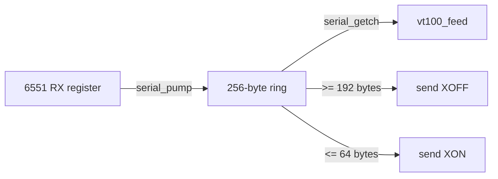

# Serial I/O (6551 ACIA)

[serial.c](../serial.c) drives the 6551 ACIA on the Super Serial Card at
**9600 baud, 8N1**. It auto-detects the card's slot, buffers received bytes in a
ring, and applies XON/XOFF flow control so the host can be told to pause while
the Apple is busy drawing.

## Registers

The 6551's four registers sit at `$C088 + slot*16`:

| Offset | Register | Notes |
|--------|----------|-------|
| `+0` | Data | Read = received byte; write = transmit byte |
| `+1` | Status | RDRF (`0x08`) = receive full; TDRE (`0x10`) = transmit empty; write = reset |
| `+2` | Command | `0x0B` = no parity/echo/IRQ, DTR + RTS asserted |
| `+3` | Control | `0x1E` = 9600 baud, 8 data bits, 1 stop bit |

The register pointer is declared **`volatile`** — these are memory-mapped I/O
locations, so every access must be a real bus cycle and must not be optimized or
cached by the compiler. Forgetting `volatile` here is a classic and confusing
bug (see [docs/LESSONS.md](LESSONS.md)).

```c
static volatile unsigned char *acia = (volatile unsigned char *)0xC0A8; /* slot 2 */
```

## Slot auto-detection

Rather than hardcode slot 2, `serial_init()` scans slots 7→1 for the Super Serial
Card's firmware signature (the Pascal 1.1 protocol bytes ADTPro's `FindSlot`
looks for):

```
$Cn05 == $38   $Cn07 == $18   $Cn0B == $01   $Cn0C == $31
```

The first match sets `acia = $C088 + slot*16`. If nothing matches it falls back
to slot 2 (`$C0A8`), which is where MAME wires the card.

## Receive ring buffer and flow control

Received bytes are drained from the one-byte hardware register into a 256-byte
ring so nothing is lost while the terminal is busy:



- **`serial_pump()`** copies every byte the ACIA holds into the ring. It is
  called from the main loop **and** from inside the slow screen loops, so the
  register never overruns. When the ring reaches 192 bytes it sends **XOFF**.
- **`serial_getch()`** removes a byte for the parser and sends **XON** once the
  ring drains back to 64 bytes.
- **`serial_put()`** waits for TDRE, then writes the byte — and **drains RX while
  it waits**. Without that, a multi-byte reply (like the `ESC[?1;0c` answer to a
  Device Attributes request) would block long enough for the host's next bytes to
  overrun the receive register. See [docs/LESSONS.md](LESSONS.md).
- **When the ring is full**, both `serial_pump()` and `serial_put()` stop copying
  and leave the byte in the hardware register rather than lapping `r_head` past
  `r_tail` and silently overwriting unread data. The ring carries **no occupancy
  counter**: it is a single-producer/single-consumer FIFO whose only state is
  `r_head` and `r_tail` (both `unsigned char`, so they wrap mod 256 for free). One
  slot is kept as a sentinel, so `r_head == r_tail` means empty and
  `(r_head + 1) == r_tail` means full — 255 bytes usable. Occupancy for the
  XON/XOFF thresholds is just `(unsigned char)(r_head - r_tail)`. Because each
  pointer is written by only one side and a single-byte store is atomic on the
  6502, this needs no critical section even once RX becomes interrupt-driven.
  XON/XOFF normally keeps the ring well below full, so reaching the cap means the
  host ignored XOFF; the excess is dropped cleanly instead of corrupting the
  buffer.

## Overrun: the recurring theme

The 6551 buffers exactly one received byte. At 9600 baud that byte must be
consumed within about a millisecond. Anything that keeps the CPU from draining
the register that long loses data. Two situations cause it, and both are handled:

1. **Slow screen operations** (clears, scrolls, character shifts) — mitigated by
   calling `serial_pump()` every 8 cells inside those loops
   ([docs/80COLUMN.md](80COLUMN.md)).
2. **Transmitting a reply** — mitigated by draining RX inside `serial_put()`'s
   transmit-wait loop.

### Receive overrun while replying

The 6551 is **full duplex** at the shift-register level — transmitter and receiver
run independently — but it still buffers only **one** received byte in RDR. If the
CPU does not read RDR within about a byte time (~1 ms at 9600 baud), the next
completing byte overwrites it and the `OVERRUN` status bit is set. That is faithful
6551 behaviour, and MAME's `mos6551` models it exactly (separate TX/RX state
machines; overwrite-on-overrun in the receiver).

Emitting a CPR is *not* fully covered by our RX draining. `serial_put()` drains RX
only while it spins on `TDRE == 0`; several windows in the reply path leave RDRF
unserviced for too long:

- `put_dec()` does software `/10` / `%10` division with no RX polling;
- when `TDRE` is already set on entry, `serial_put()` writes immediately and drains
  nothing;
- after the final reply byte is queued, control returns up through
  `report_cursor()` / the parser before the main loop pumps RX again.

So when two `ESC[6n` requests arrive back to back and the **second overlaps the
first CPR's transmission**, a byte of the second request is overrun in RDR: its
`ESC[6` prefix never reaches the parser, the surviving `n` prints as a literal
glyph, and the RAM `cur_col` advances by one. (`report_cursor()` only *reads* the
cursor via pure getters, so the reply path itself never moves it — the drift is
entirely the stray glyph.)

This was confirmed with a **raw-socket reproduction that bypasses the conformance
harness entirely** (no windowing, no injected `ESC[6n`; RAM read directly via the
MAME Lua memory probe):

| Input (cursor parked at row 10, col 30) | `cur_col` drift | CPRs returned | Screen |
| --- | --- | --- | --- |
| single `ESC[6n` | 0 | 1 | clean |
| `ESC[6n` → wait for CPR → `ESC[6n` (paced) | 0 | 2 | clean |
| `ESC[6n ESC[6n` back to back (overlaps TX) | **+1** | **1** | stray `n` |

Only the overlapping pair drifts, and it also **loses the second CPR** (the second
request is genuinely corrupted). The paced pair is perfectly clean with both CPRs
correct. This is therefore a **genuine firmware receive-overrun**, real-hardware
class under the same byte timing — **not** a MAME artifact. (An earlier analysis
misattributed it to the emulator; the raw repro and the MAME 6551 source disprove
that.)

The correct fix is **interrupt-driven RX** — an ISR that drains RDR the moment
a byte arrives, decoupled from whatever the main loop is transmitting. The pointer
FIFO in `serial.c` is already structured for that (single-producer/consumer, no
critical section). A smaller polled fix (interleave `serial_pump()` through
`report_cursor()` / `put_dec()`, or make `serial_put()` drain RX *before* the TDRE
check) could also close this specific window. This defect is tracked to land with
the interrupt-driven RX work.

The conformance corpus documents the defect with `report-cpr-6n-idempotent`
(category `reports`), marked `unsupported` so it scores as a clean **XFAIL** today
and flips to **UNEXPECTED_PASS** once the interrupt-driven RX work removes the
overrun — promote it to `supported` then. Note the reports harness independently
chunks and paces input with its own `ESC[6n`, which amplifies the drift observed
*through the runner* but is not its cause. See [docs/CONFORMANCE.md](CONFORMANCE.md)
and [docs/TERMINAL.md](TERMINAL.md#csi--reports-and-modes).

## MAME wiring

MAME connects the card's RS-232 port to a null modem whose bitstream is a TCP
socket, and connects **out** to that socket — so a host must be listening first:

```
-sl2 ssc -sl2:ssc:rs232 null_modem -bitb socket.127.0.0.1:6551
```

`-aux ext80` supplies the auxiliary RAM the 80-column display needs.

### The `a2ssc` ROM

`-sl2 ssc` requires the Super Serial Card firmware ROM (`a2ssc`,
`341-0065-a.bin`). Place it under your MAME `roms/a2ssc/`. The
terminal's slot auto-detection reads this firmware's signature.

## Real hardware

On a physical IIe the same firmware runs unchanged. Wire a USB/RS-232 adapter to
the Super Serial Card and use the `serial` transport in the Python clients, which
auto-detect the port and baud. See [docs/BRIDGE.md](BRIDGE.md).
