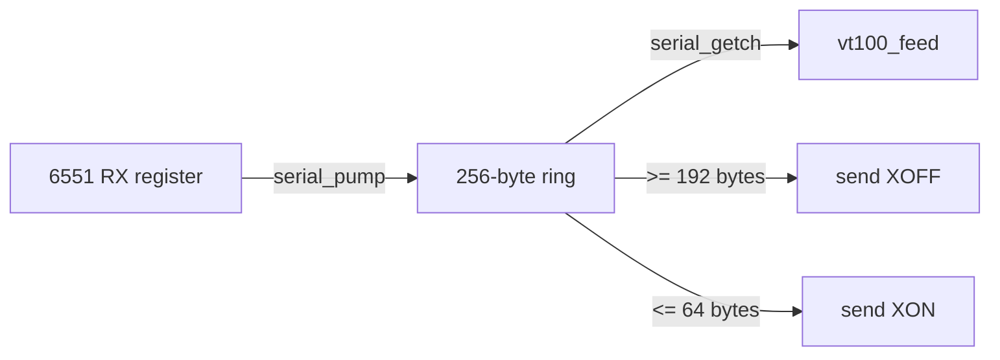

# Serial I/O (6551 ACIA)

[serial.c](../serial.c) drives the 6551 ACIA on the Super Serial Card at
**9600 baud, 8N1**. It auto-detects the card's slot, buffers received bytes in a
ring, and applies XON/XOFF flow control so the host can be told to pause while
the Apple is busy drawing.

## Registers

The 6551's four registers sit at `$C088 + slot*16`:

| Offset | Register | Notes |
|--------|----------|-------|
| `+0` | Data | Read = received byte; write = transmit byte |
| `+1` | Status | RDRF (`0x08`) = receive full; TDRE (`0x10`) = transmit empty; write = reset |
| `+2` | Command | `0x0B` = no parity/echo/IRQ, DTR + RTS asserted |
| `+3` | Control | `0x1E` = 9600 baud, 8 data bits, 1 stop bit |

The register pointer is declared **`volatile`** — these are memory-mapped I/O
locations, so every access must be a real bus cycle and must not be optimized or
cached by the compiler. Forgetting `volatile` here is a classic and confusing
bug (see [docs/LESSONS.md](LESSONS.md)).

```c
static volatile unsigned char *acia = (volatile unsigned char *)0xC0A8; /* slot 2 */
```

## Slot auto-detection

Rather than hardcode slot 2, `serial_init()` scans slots 7→1 for the Super Serial
Card's firmware signature (the Pascal 1.1 protocol bytes ADTPro's `FindSlot`
looks for):

```
$Cn05 == $38   $Cn07 == $18   $Cn0B == $01   $Cn0C == $31
```

The first match sets `acia = $C088 + slot*16`. If nothing matches it falls back
to slot 2 (`$C0A8`), which is where MAME wires the card.

## Receive ring buffer and flow control

Received bytes are drained from the one-byte hardware register into a 256-byte
ring so nothing is lost while the terminal is busy:



- **`serial_pump()`** copies every byte the ACIA holds into the ring. It is
  called from the main loop **and** from inside the slow screen loops, so the
  register never overruns. When the ring reaches 192 bytes it sends **XOFF**.
- **`serial_getch()`** removes a byte for the parser and sends **XON** once the
  ring drains back to 64 bytes.
- **`serial_put()`** waits for TDRE, then writes the byte — and **drains RX while
  it waits**. Without that, a multi-byte reply (like the `ESC[?1;0c` answer to a
  Device Attributes request) would block long enough for the host's next bytes to
  overrun the receive register. See [docs/LESSONS.md](LESSONS.md).

## Overrun: the recurring theme

The 6551 buffers exactly one received byte. At 9600 baud that byte must be
consumed within about a millisecond. Anything that keeps the CPU from draining
the register that long loses data. Two situations cause it, and both are handled:

1. **Slow screen operations** (clears, scrolls, character shifts) — mitigated by
   calling `serial_pump()` every 8 cells inside those loops
   ([docs/80COLUMN.md](80COLUMN.md)).
2. **Transmitting a reply** — mitigated by draining RX inside `serial_put()`'s
   transmit-wait loop.

## MAME wiring

MAME connects the card's RS-232 port to a null modem whose bitstream is a TCP
socket, and connects **out** to that socket — so a host must be listening first:

```
-sl2 ssc -sl2:ssc:rs232 null_modem -bitb socket.127.0.0.1:6551
```

`-aux ext80` supplies the auxiliary RAM the 80-column display needs.

### The `a2ssc` ROM

`-sl2 ssc` requires the Super Serial Card firmware ROM (`a2ssc`,
`341-0065-a.bin`). Place it under your MAME `roms/a2ssc/`. The
terminal's slot auto-detection reads this firmware's signature.

## Real hardware

On a physical IIe the same firmware runs unchanged. Wire a USB/RS-232 adapter to
the Super Serial Card and use the `serial` transport in the Python clients, which
auto-detect the port and baud. See [docs/BRIDGE.md](BRIDGE.md).
