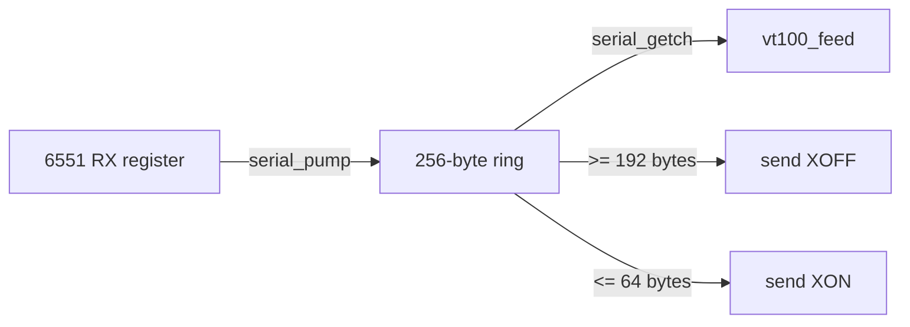

# Serial I/O (6551 ACIA)

[serial.c](../serial.c) drives the 6551 ACIA on the Super Serial Card at
**9600 baud, 8N1**. It auto-detects the card's slot, buffers received bytes in a
ring, and applies XON/XOFF flow control so the host can be told to pause while
the Apple is busy drawing.

## Registers

The 6551's four registers sit at `$C088 + slot*16`:

| Offset | Register | Notes |
|--------|----------|-------|
| `+0` | Data | Read = received byte; write = transmit byte |
| `+1` | Status | RDRF (`0x08`) = receive full; TDRE (`0x10`) = transmit empty; write = reset |
| `+2` | Command | `0x0B` = no parity/echo/IRQ, DTR + RTS asserted |
| `+3` | Control | `0x1E` = 9600 baud, 8 data bits, 1 stop bit |

The register pointer is declared **`volatile`** — these are memory-mapped I/O
locations, so every access must be a real bus cycle and must not be optimized or
cached by the compiler. Forgetting `volatile` here is a classic and confusing
bug (see [docs/LESSONS.md](LESSONS.md)).

TDR writes are the exception to using that dynamic pointer directly. cc65 emits
`STA (zp),Y` for an indirect write, and the NMOS 6502 dummy-reads the destination
before the write. A dummy read of the data register consumes RDR. `write_tdr()`
therefore selects a slot-specific **volatile absolute store** (`STA $C0x8`), which
has no destructive read cycle.

```c
static volatile unsigned char *acia = (volatile unsigned char *)0xC0A8; /* slot 2 */
```

## Slot auto-detection

Rather than hardcode slot 2, `serial_init()` scans slots 7→1 for the Super Serial
Card's firmware signature (the Pascal 1.1 protocol bytes ADTPro's `FindSlot`
looks for):

```
$Cn05 == $38   $Cn07 == $18   $Cn0B == $01   $Cn0C == $31
```

The first match sets `acia = $C088 + slot*16`. If nothing matches it falls back
to slot 2 (`$C0A8`), which is where MAME wires the card.

## Receive ring buffer and flow control

Received bytes are drained from the one-byte hardware register into a 256-byte
ring so nothing is lost while the terminal is busy:



- **`serial_pump()`** copies every byte the ACIA holds into the ring. It is
  called from the main loop **and** from inside the slow screen loops, so the
  register never overruns. When the ring reaches 192 bytes it sends **XOFF**.
- **`serial_getch()`** removes a byte for the parser and sends **XON** once the
  ring drains back to 64 bytes.
- **`serial_put()`** drains RX **before every TDRE check, including the first**,
  then emits the byte through `write_tdr()`'s absolute store. The first drain
  matters when TDRE is already ready: a multi-byte reply (like the `ESC[?1;0c`
  answer to a Device Attributes request) must still receive the host's immediately
  following bytes.
- **When the ring is full**, both `serial_pump()` and `serial_put()` stop copying
  and leave the byte in the hardware register rather than lapping `r_head` past
  `r_tail` and silently overwriting unread data. The ring carries **no occupancy
  counter**: it is a single-producer/single-consumer FIFO whose only state is
  `r_head` and `r_tail` (both `unsigned char`, so they wrap mod 256 for free). One
  slot is kept as a sentinel, so `r_head == r_tail` means empty and
  `(r_head + 1) == r_tail` means full — 255 bytes usable. Occupancy for the
  XON/XOFF thresholds is just `(unsigned char)(r_head - r_tail)`. Because each
  pointer is written by only one side and a single-byte store is atomic on the
  6502, this needs no critical section even once RX becomes interrupt-driven.
  XON/XOFF normally keeps the ring well below full, so reaching the cap means the
  host ignored XOFF; the excess is dropped cleanly instead of corrupting the
  buffer.

The ring FIFO itself (push/pop/occupancy/full/empty over `r_head`/`r_tail`) lives
in its own module, [`ring.c`](../ring.c) / [`ring.h`](../ring.h); `serial.c`
layers the 6551 register access and XON/XOFF flow control on top. Keeping the
ring standalone lets the host unit test link the real code and gives the planned
interrupt-driven RX path a clean seam.

## Overrun: the recurring theme

The 6551 buffers exactly one received byte. At 9600 baud that byte must be
consumed within about a millisecond. Anything that keeps the CPU from draining
the register that long loses data. Two situations cause it, and both are handled:

1. **Slow screen operations** (clears, scrolls, character shifts) — mitigated by
   calling `serial_pump()` every 8 cells inside those loops
   ([docs/80COLUMN.md](80COLUMN.md)).
2. **Transmitting a reply** — mitigated by draining RX inside `serial_put()`'s
   transmit-wait loop.

### Receive loss while replying

The 6551 is **full duplex** at the shift-register level, but it buffers only one
received byte in RDR. The old synchronous reply path had three distinct loss
windows when input arrived while a CPR or DA response was being transmitted:

1. `serial_put()` checked TDRE before RDRF, so an immediately-ready transmit
   skipped RX draining.
2. cc65's dynamic-pointer TDR write used `STA (zp),Y`; the 6502 dummy read of the
   data register consumed RDR and cleared receive status before writing TDR.
3. `put_dec()` used cc65's slow `/10` and `%10` runtime while formatting CPR
   coordinates, leaving RDR unserviced for more than a byte time.

The repair closes each window directly: a do/while pre-drain runs before the first
and every later TDRE check, `write_tdr()` uses slot-specific absolute stores, and
coordinate formatting uses at most eight subtractions instead of division. This
is real-hardware behavior, not an emulator workaround.

Two ROM-backed corpus cases guard the result:

- `report-da-overlap-lossless` packs seven `DA -> private CSI -> marker` groups
  into one transport window and requires all seven replies, all marker bytes, and
  no literal CSI residue.
- `report-cpr-6n-idempotent` requires two exact CPR replies and unchanged RAM
  cursor state for back-to-back `ESC[6n`, closing issue #24.

Interrupt-driven RX remains the broader defense against arbitrary long CPU stalls
or hosts that ignore flow control. The synchronous report-overlap paths above are
now covered without claiming that all possible receive-overrun sources are gone.
See [docs/CONFORMANCE.md](CONFORMANCE.md) and
[docs/TERMINAL.md](TERMINAL.md#csi--reports-and-modes).

## MAME wiring

MAME connects the card's RS-232 port to a null modem whose bitstream is a TCP
socket, and connects **out** to that socket — so a host must be listening first:

```
-sl2 ssc -sl2:ssc:rs232 null_modem -bitb socket.127.0.0.1:6551
```

`-aux ext80` supplies the auxiliary RAM the 80-column display needs.

### The `a2ssc` ROM

`-sl2 ssc` requires the Super Serial Card firmware ROM (`a2ssc`,
`341-0065-a.bin`). Place it under your MAME `roms/a2ssc/`. The
terminal's slot auto-detection reads this firmware's signature.

## Real hardware

On a physical IIe the same firmware runs unchanged. Wire a USB/RS-232 adapter to
the Super Serial Card and use the `serial` transport in the Python clients, which
auto-detect the port and baud. See [docs/BRIDGE.md](BRIDGE.md).
