# Terminal reference

The parser in [vt100.c](../vt100.c) recognizes a practical VT100/ANSI subset —
enough to drive an interactive bash session with line editing, plus the cursor
and erase control that full-screen programs rely on. Everything it does not
implement is consumed silently so it can never corrupt the screen.

## Parser state machine

```mermaid
stateDiagram-v2
    [*] --> NORMAL
    NORMAL --> ESC: 0x1B
    NORMAL --> NORMAL: printable / CR LF BS TAB BEL
    ESC --> CSI: '['
    ESC --> NORMAL: D M E (IND/RI/NEL) or unknown
    CSI --> CSI: digits, ';', '?'
    CSI --> NORMAL: final byte 0x40-0x7E (dispatch)
```

- **NORMAL** renders printable bytes (`0x20`–`0x7E`) and acts on the C0 controls
  CR, LF, BS, HT (tab to the next 8-column stop), and BEL (speaker click).
- **ESC** handles the two-byte escapes `ESC D` (IND), `ESC M` (RI), `ESC E`
  (NEL); any other second byte is ignored.
- **CSI** (after `ESC [`) accumulates numeric parameters separated by `;`, notes
  a leading `?` private marker, then dispatches on the final byte.

Parameters: up to 4, each a 16-bit value; a `?` sets the private-mode flag used
to distinguish, e.g., DECSTBM (`ESC[r`) from private resets (`ESC[?..r`).

## Control characters (NORMAL state)

| Byte | Name | Action |
|------|------|--------|
| `0x07` | BEL | Short speaker click |
| `0x08` | BS | Cursor left one column (no erase) |
| `0x09` | HT | Cursor to the next multiple-of-8 column |
| `0x0A` | LF | Cursor down; scroll at the bottom margin |
| `0x0D` | CR | Cursor to column 1 |

## Escape sequences

`Ps` is a single numeric parameter (default shown); `Ps;Ps` is two.

### Two-byte escapes

| Sequence | Name | Action |
|----------|------|--------|
| `ESC D` | IND | Index: cursor down, scroll at the bottom margin |
| `ESC M` | RI | Reverse index: cursor up, scroll **down** at the top margin |
| `ESC E` | NEL | Next line: CR + LF |

### CSI — cursor motion

| Sequence | Name | Action |
|----------|------|--------|
| `ESC [ Ps A` | CUU | Cursor up `Ps` (default 1), clamped |
| `ESC [ Ps B` | CUD | Cursor down |
| `ESC [ Ps C` | CUF | Cursor forward |
| `ESC [ Ps D` | CUB | Cursor back |
| `ESC [ Ps ; Ps H` / `f` | CUP / HVP | Move to row;col (1-based) |
| `ESC [ Ps G` / `` Ps ` `` | CHA / HPA | Move to absolute column |
| `ESC [ Ps d` | VPA | Move to absolute row |
| `ESC [ Ps E` | CNL | Cursor to start of line `Ps` down |
| `ESC [ Ps F` | CPL | Cursor to start of line `Ps` up |
| `ESC [ s` / `ESC [ u` | DECSC / DECRC | Save / restore cursor position |

### CSI — erase, scroll, and editing

| Sequence | Name | Action |
|----------|------|--------|
| `ESC [ Ps J` | ED | Erase display: 0 = to end, 1 = to cursor, 2 = all + home |
| `ESC [ Ps K` | EL | Erase line: 0 = to end, 1 = to cursor, 2 = whole line |
| `ESC [ Ps ; Ps r` | DECSTBM | Set scroll region `top;bottom`, home the cursor |
| `ESC [ Ps L` | IL | Insert `Ps` blank lines at the cursor |
| `ESC [ Ps M` | DL | Delete `Ps` lines at the cursor |
| `ESC [ Ps @` | ICH | Insert `Ps` blanks, shifting the line right |
| `ESC [ Ps P` | DCH | Delete `Ps` chars, shifting the line left |
| `ESC [ Ps X` | ECH | Erase `Ps` chars in place |

Insert/delete-line operate within the current scroll region. Insert/delete-char
operate within the cursor's row.

### CSI — reports and modes

| Sequence | Name | Reply / effect |
|----------|------|--------|
| `ESC [ 6 n` | DSR | Sends `ESC [ row ; col R` (used heavily by the test suite) |
| `ESC [ 5 n` | DSR | Sends `ESC [ 0 n` (terminal OK) |
| `ESC [ c` | DA | Sends `ESC [ ? 1 ; 0 c` (identify as a VT100) |
| `ESC [ ? 1 h` / `l` | DECCKM | Enable / disable application cursor keys |

### Consumed and ignored

SGR (`ESC [ Ps m`, colors and attributes) and any unrecognized final byte are
parsed and discarded. This keeps `ls --color`, prompts with color, and other
styled output readable rather than littering the screen with escape residue.
Private mode sets/resets other than DECCKM are likewise absorbed.

## Keyboard map

The keyboard is polled at `$C000` with the strobe cleared at `$C010`. The high
bit is stripped to yield ASCII, which is sent as-is — **except** the arrow keys,
which the IIe delivers as raw control codes. `term.c` translates them:

| Key | IIe code | Sent (normal) | Sent (application, DECCKM) |
|-----|----------|---------------|-----------------------------|
| ← | `0x08` | `ESC [ D` | `ESC O D` |
| → | `0x15` | `ESC [ C` | `ESC O C` |
| ↑ | `0x0B` | `ESC [ A` | `ESC O A` |
| ↓ | `0x0A` | `ESC [ B` | `ESC O B` |
| Delete | `0x7F` | `0x7F` | `0x7F` |

Full-screen applications such as `vi` switch the arrows to application mode by
sending `ESC[?1h`; the terminal then emits `ESC O x` so the app sees cursor keys
rather than plain control codes.

To add a sequence, see [docs/HACKING.md](HACKING.md).
