# Terminal reference

The parser in [vt100.c](../vt100.c) recognizes a practical VT100/ANSI subset —
enough to drive an interactive bash session with line editing, plus the cursor
and erase control that full-screen programs rely on. Everything it does not
implement is consumed silently so it can never corrupt the screen.

## Parser state machine

```mermaid
stateDiagram-v2
    [*] --> NORMAL
    NORMAL --> ESC: 0x1B
    NORMAL --> NORMAL: printable / ENQ CR LF BS TAB BEL
    ESC --> CSI: '['
    ESC --> STRING: ']' 'P' '^' '_' (OSC/DCS/PM/APC)
    ESC --> NORMAL: D M E (IND/RI/NEL) or unknown
    CSI --> CSI: digits, ';', '?', '>', '='
    CSI --> NORMAL: final byte 0x40-0x7E (dispatch)
    STRING --> STRING: payload bytes
    STRING --> NORMAL: ST (ESC \) or BEL
```

- **NORMAL** renders printable bytes (`0x20`–`0x7E`) and acts on the C0 controls
  ENQ (answerback), CR, LF, VT and FF (all three index down one line), BS, HT
  (tab to the next 8-column stop), and BEL (speaker click).
- **ESC** handles the two-byte escapes `ESC D` (IND), `ESC M` (RI), `ESC E`
  (NEL); the string introducers `ESC ]` (OSC), `ESC P` (DCS), `ESC ^` (PM),
  `ESC _` (APC) switch to STRING; any other second byte is ignored.
- **CSI** (after `ESC [`) accumulates numeric parameters separated by `;`, notes
  a leading `?` private marker or a `>`/`=` device-attributes marker, then
  dispatches on the final byte.
- **STRING** swallows an OSC/DCS/PM/APC payload until its String Terminator
  (`ESC \`) or, for OSC, a BEL — so the payload never prints as literal text.

Parameters: up to 4, each a 16-bit value; a `?` sets the private-mode flag used
to distinguish, e.g., DECSTBM (`ESC[r`) from private resets (`ESC[?..r`), and a
`>`/`=` marker distinguishes secondary/tertiary Device Attributes from primary.

## Control characters (NORMAL state)

| Byte | Name | Action |
|------|------|--------|
| `0x05` | ENQ | Transmit the answerback string `A2VT100` over the host link |
| `0x07` | BEL | Short speaker click |
| `0x08` | BS | Cursor left one column (no erase) |
| `0x09` | HT | Cursor to the next multiple-of-8 column |
| `0x0A` | LF | Cursor down; scroll at the bottom margin |
| `0x0B` | VT | Same as LF (cursor down; scroll at the bottom margin) |
| `0x0C` | FF | Same as LF (cursor down; scroll at the bottom margin) |
| `0x0D` | CR | Cursor to column 1 |
| `0x0E` | SO | Locking shift out (LS1): invoke G1 as the active (GL) set |
| `0x0F` | SI | Locking shift in (LS0): invoke G0 as the active (GL) set |

## Escape sequences

`Ps` is a single numeric parameter (default shown); `Ps;Ps` is two.

### Two-byte escapes

| Sequence | Name | Action |
|----------|------|--------|
| `ESC D` | IND | Index: cursor down, scroll at the bottom margin |
| `ESC M` | RI | Reverse index: cursor up, scroll **down** at the top margin |
| `ESC E` | NEL | Next line: CR + LF |
| `ESC c` | RIS | Hard reset: clear, home, default attributes/charset/modes/region |
| `ESC ( 0` / `ESC ( B` | SCS | Select DEC line-drawing / ASCII for G0 |
| `ESC ) 0` / `ESC ) B` | SCS | Select DEC line-drawing / ASCII for G1 |

### CSI — cursor motion

| Sequence | Name | Action |
|----------|------|--------|
| `ESC [ Ps A` | CUU | Cursor up `Ps` (default 1), clamped |
| `ESC [ Ps B` | CUD | Cursor down |
| `ESC [ Ps C` | CUF | Cursor forward |
| `ESC [ Ps D` | CUB | Cursor back |
| `ESC [ Ps ; Ps H` / `f` | CUP / HVP | Move to row;col (1-based) |
| `ESC [ Ps G` / `` Ps ` `` | CHA / HPA | Move to absolute column |
| `ESC [ Ps d` | VPA | Move to absolute row |
| `ESC [ Ps E` | CNL | Cursor to start of line `Ps` down |
| `ESC [ Ps F` | CPL | Cursor to start of line `Ps` up |
| `ESC [ s` / `ESC [ u` | DECSC / DECRC | Save / restore cursor position |

### CSI — erase, scroll, and editing

| Sequence | Name | Action |
|----------|------|--------|
| `ESC [ Ps J` | ED | Erase display: 0 = to end, 1 = to cursor, 2 = all (erased in place; the cursor does not move, per ECMA-48 §8.3.39) |
| `ESC [ Ps K` | EL | Erase line: 0 = to end, 1 = to cursor, 2 = whole line |
| `ESC [ Ps ; Ps r` | DECSTBM | Set scroll region `top;bottom`, home the cursor |
| `ESC [ Ps L` | IL | Insert `Ps` blank lines at the cursor |
| `ESC [ Ps M` | DL | Delete `Ps` lines at the cursor |
| `ESC [ Ps @` | ICH | Insert `Ps` blanks, shifting the line right |
| `ESC [ Ps P` | DCH | Delete `Ps` chars, shifting the line left |
| `ESC [ Ps X` | ECH | Erase `Ps` chars in place |

Insert/delete-line operate within the current scroll region. Insert/delete-char
operate within the cursor's row.

### CSI — reports and modes

| Sequence | Name | Reply / effect |
|----------|------|--------|
| `ESC [ 6 n` | DSR | Sends `ESC [ row ; col R` (used heavily by the test suite). Reporting only *reads* the cursor, so the reply path itself never moves `cur_col`/`cur_row`. Interrupt-driven RX retains back-to-back requests while TX queues both replies in order. |
| `ESC [ 5 n` | DSR | Sends `ESC [ 0 n` (terminal OK) |
| `ESC [ c` | Primary DA | Sends `ESC [ ? 1 ; 0 c` (identify as a VT100) |
| `ESC [ > c` | Secondary DA | Sends `ESC [ > 1 ; 0 ; 0 c` (VT220-family, version 0) |
| `ESC [ = c` | Tertiary DA | Consumed cleanly; no reply (the DCS-form report is not implemented) |
| `ESC [ ? 1 h` / `l` | DECCKM | Enable / disable application cursor keys |
| `ESC [ ? 25 h` / `l` | DECTCEM | Show / hide the visible text cursor (see below) |
| `ESC [ ? 47/1047/1049 h` / `l` | Alt screen | Switch to / from the alternate screen buffer (save + restore); the active SGR attribute is reset to normal on both enter and exit |
| `ESC [ ! p` | DECSTR | Soft reset: attributes, charset, modes, region (no clear) |
| `ESC [ Ps m` | SGR | `7` = inverse video on, `0`/`27` = off; colors, bold, and 256/truecolor (`38;5;Ps` / `38;2;R;G;B`, and the `48;…` background forms) are consumed |

### String sequences (OSC / DCS / PM / APC)

| Sequence | Name | Action |
|----------|------|--------|
| `ESC ] … BEL` / `ESC ] … ST` | OSC | Operating System Command (e.g. window title `ESC]0;title BEL`) — payload swallowed, nothing rendered |
| `ESC P … ST` | DCS | Device Control String (e.g. DECRQSS, sixel) — payload swallowed, nothing rendered |
| `ESC ^ … ST` | PM | Privacy Message — payload swallowed |
| `ESC _ … ST` | APC | Application Program Command — payload swallowed |

These string controls run until their String Terminator (ST = `ESC \`) or, for
OSC, a BEL. The terminal does not act on them (there is no window to title, and
no DCS reply is generated), but it consumes the whole string so the payload can
never leak onto the screen as literal text.

### Consumed and ignored

Inverse video (`SGR 7`) is rendered using the IIe's inverse character codes; the
video page stores the display glyph directly, so inverse survives scrolling,
insert/delete, and the alternate-screen save/restore. Insert/delete read glyphs
back from the video page when they shift cells. Because the non-enhanced apple2e
character set has no inverse lower case, inverse lower-case text shows as inverse
**upper** case.

Switching the alternate screen on or off (`ESC [ ? 47/1047/1049 h` / `l`) resets
the active SGR attribute to normal. Full-screen apps such as `less` and `man`
select inverse for a status line and then quit via the alternate-screen reset
without first clearing it; resetting on the transition keeps that inverse
attribute from leaking onto the restored shell text.

Colors, bold, and any other SGR attributes are parsed and discarded, as is any
unrecognized final byte. 256-color and truecolor selectors (`38;5;Ps`,
`38;2;R;G;B`, and the `48;…` background forms) skip their color arguments so a
color index or RGB component is never misread as an attribute. This keeps
`ls --color`, colored prompts, and other styled output readable rather than
littering the screen with escape residue. Private mode sets/resets other than
the ones listed above are likewise absorbed. OSC/DCS/PM/APC strings are swallowed
whole (until ST or BEL), so window-title, DECRQSS, and sixel-style payloads never
appear on screen.

## Visible text cursor

The terminal draws a cursor so a human can see where the next keystroke or edit
will land. It is an **overlay**, not a stored glyph: the main loop
([term.c](../term.c)) paints it only while the receive ring is empty and erases
it before rendering any received byte, so no screen operation (scroll, erase,
insert, alternate-screen save) ever runs against a screen that still has the
cursor on it — the stored video glyph can never desync. An earlier attempt that
toggled the cursor inline between bytes corrupted rendering; this design avoids
that by keeping the cursor strictly off the screen whenever the parser is doing
anything.

The cursor is rendered by **inverting the cell relative to its own attribute**
(normal text under the cursor shows inverse, inverse text shows normal), so it is
visible over both and never changes which letter the cell displays. It is a
steady (non-blinking) cursor.

`ESC [ ? 25 l` (DECTCEM reset) hides it and `ESC [ ? 25 h` (set) shows it again;
`RIS` and `DECSTR` restore it to visible. The show/hide state lives in a firmware
global (`cursor_visible`) that the conformance state probe reads to verify
DECTCEM. The conformance and screen probes strip the overlay from the video-RAM
read-back (using `cursor_shown` / `cursor_saved`) so tests always see the logical
screen, never the cursor.

## Character sets and line drawing

The terminal tracks two graphic sets, G0 and G1, and an active (GL) selector.
`ESC ( 0` / `ESC ( B` designate DEC special-graphics (line-drawing) or ASCII for
**G0**; `ESC ) 0` / `ESC ) B` do the same for **G1**. The locking shifts choose
which designated set GL invokes: SO (`0x0E`, LS1) invokes G1 and SI (`0x0F`, LS0)
invokes G0. Printable bytes are then rendered through whichever set is currently
active — so, for example, designating G1 as line-drawing (`ESC ) 0`) and issuing
SO makes subsequent glyphs draw from the special-graphics set until SI returns to
G0. GL starts on G0 with both sets at ASCII; RIS, DECSTR, and `vt100_init` reset
the designations and return GL to G0.

Because SO and SI are C0 controls, they take effect wherever they appear in a
non-string sequence, not just between complete sequences. An SO or SI embedded
mid-CSI or between `ESC (` / `ESC )` and its charset designator invokes the shift
immediately without aborting the pending sequence, which still completes normally
(for example, `ESC [ 2` SO `J q` performs the SO, finishes the erase, and renders
`q` through the newly active set). Inside an OSC/DCS/PM/APC string the two bytes
are swallowed as payload like any other, so a locking shift never fires from
within a control string.

While a special-graphics set is active, the box-drawing codes are mapped to the
closest ASCII the IIe can show — horizontal `q`→`-`, vertical `x`→`|`, and all
corners/tees/cross→`+` — because real box glyphs would need MouseText, which the
non-enhanced apple2e lacks.

## Keyboard map

The keyboard is polled at `$C000` with the strobe cleared at `$C010`. The high
bit is stripped to yield ASCII, which is sent as-is — **except** the arrow keys,
which the IIe delivers as raw control codes. `term.c` translates them:

| Key | IIe code | Sent (normal) | Sent (application, DECCKM) |
|-----|----------|---------------|-----------------------------|
| ← | `0x08` | `ESC [ D` | `ESC O D` |
| → | `0x15` | `ESC [ C` | `ESC O C` |
| ↑ | `0x0B` | `ESC [ A` | `ESC O A` |
| ↓ | `0x0A` | `ESC [ B` | `ESC O B` |
| Delete | `0x7F` | `0x7F` | `0x7F` |

Full-screen applications such as `vi` switch the arrows to application mode by
sending `ESC[?1h`; the terminal then emits `ESC O x` so the app sees cursor keys
rather than plain control codes.

To add a sequence, see [docs/HACKING.md](HACKING.md).
