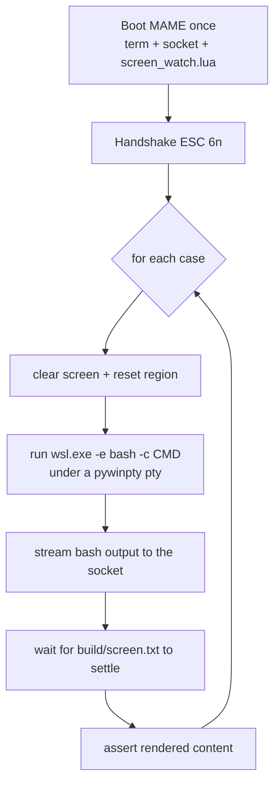

# Testing

Every feature is verified by booting the terminal in **headless MAME** and
checking the result over the serial socket. There are two harnesses, both
CI-friendly (non-zero exit on failure).

| Harness | Verifies | How |
|---------|----------|-----|
| `client/vt100_test.py` | Cursor motion, keyboard | The terminal's own position reports and transmitted bytes |
| `client/shell_test.py` | Rendered screen from real shell output | A snapshot of the 80×24 screen |

## Cursor tests — `vt100_test.py`

```sh
python client/vt100_test.py
```

Each case sends a setup + operation, then asks the terminal where its cursor is
(`ESC[6n` → `ESC[row;colR`) and compares to the expected position:

```python
CURSOR_TESTS = [
    ("cup", b"\x1b[2J\x1b[8;20H", (8, 20)),
    ("ind", b"\x1b[2J\x1b[5;10H\x1bD", (6, 10)),
    # ...
]
```

Because the terminal tracks the cursor in software, these reports are exact,
which makes cursor behavior testable without reading the screen at all.

## Keyboard tests — `vt100_test.py --keys`

```sh
python client/vt100_test.py --keys        # normal cursor keys
python client/vt100_test.py --keys --app  # application cursor keys (DECCKM)
```

MAME runs [client/keys.lua](../client/keys.lua), which injects a known key
sequence, and the test checks the bytes the Apple transmits.

- `A` and Return go through MAME's natural keyboard (they map cleanly to ASCII).
- The arrow keys are **not** in the natural-keyboard table, so the script presses
  their input ports directly (`:X6`/`:X7`, fields named with the Unicode arrows).

The `--app` variant sends `ESC[?1h` before the arrows are injected and expects
`ESC O x` instead of `ESC [ x`.

## Screen-render tests — `shell_test.py`

```sh
python client/shell_test.py         # run the suite
python client/shell_test.py -v      # also print each settled screen
python client/shell_test.py -k ls   # only cases whose label matches "ls"
```

This is the end-to-end suite. It:



- MAME runs [client/screen_watch.lua](../client/screen_watch.lua), which snapshots
  the shadow buffer at `$7000` to `build/screen.txt` about four times a second.
- Each command runs in a **fresh** `wsl.exe -e bash -c "…"` (deterministic; avoids
  the interactive-bash-under-ConPTY stall — see [docs/BRIDGE.md](BRIDGE.md)). The
  MAME terminal stays booted for the whole suite and is cleared between cases.
- A case asserts on the settled screen with simple checks: `("has", text)`,
  `("absent", text)`, and `("row", n, text)`.

```python
SHELL_TESTS = [
    ("arith",  "echo $((6*7))",                         [("has", "42")]),
    ("cursor", r"printf '\033[8;30HPOSMARK\r\n'",       [("row", 8, "POSMARK")]),
    ("dch",    r"printf '\033[7;1HABCDEFGH\033[7;3H\033[3P\r\n'",
                                                        [("row", 7, "ABFGH")]),
]
```

Outputs are chosen so a match proves the command's **output** rendered, not just
the echoed keystrokes (e.g. `echo $((6*7))` → `42`).

## How the screen dumper stays out of the way

`screen_watch.lua` reads only the non-banked shadow buffer, so it never toggles
`PAGE2` or otherwise perturbs the running terminal. It writes the whole 24-line
snapshot in one `io.open("w")` and wraps the write in `pcall`, so a transient
Windows file lock (the reader holding `screen.txt` open) can never crash the
frame notifier and freeze the dump. See [docs/LESSONS.md](LESSONS.md) for the
saga behind those two decisions.

## Requirements

- The `a2ssc` ROM and `-aux ext80` (see [docs/SERIAL.md](SERIAL.md)).
- `shell_test.py` additionally needs a working `wsl.exe` default distro and
  `pywinpty` in the Python environment. It warms up WSL (`bash -c true`) before
  timing anything, because the first WSL call cold-starts for a few seconds.
- Run MAME at **1× speed** (no `-nothrottle`) for wall-clock-long drivers:
  `-nothrottle` races through the emulated seconds of `-str` and would quit in the
  middle of the suite. The harness terminates MAME itself when done.

## Adding a test

**A cursor/keyboard behavior** → add a tuple to `CURSOR_TESTS` in
`vt100_test.py`: the bytes to send and the expected `(row, col)` from the
follow-up `ESC[6n`. Start with `\x1b[2J` so the screen is in a known state.

**A rendered-screen behavior** → add a tuple to `SHELL_TESTS` in `shell_test.py`:
a label, a shell command (or a `printf` of raw escapes), and a list of checks.
Prefer commands whose output differs from the typed text so a pass proves
rendering. If your case sets a scroll region, the harness resets it between cases
for you.

See [docs/HACKING.md](HACKING.md) for implementing the feature the test drives.
