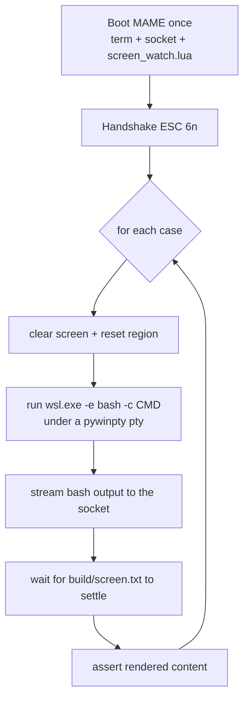

# Testing

Every feature is verified by booting the terminal in **headless MAME** and
checking the result over the serial socket. There are three harnesses, all
CI-friendly (non-zero exit on failure).

| Harness | Verifies | How |
|---------|----------|-----|
| `client/vt100_test.py` | Cursor motion, keyboard | The terminal's own position reports and transmitted bytes |
| `client/shell_test.py` | Rendered screen from real shell output | A snapshot of the 80×24 screen |
| `client/conformance/runner.py` | Spec conformance across the VT100/ECMA-48 feature space | A spec-derived corpus graded by video-RAM, state-variable, and wire probes |

## Cursor tests — `vt100_test.py`

```sh
python client/vt100_test.py
```

Each case sends a setup + operation, then asks the terminal where its cursor is
(`ESC[6n` → `ESC[row;colR`) and compares to the expected position:

```python
CURSOR_TESTS = [
    ("cup", b"\x1b[2J\x1b[8;20H", (8, 20)),
    ("ind", b"\x1b[2J\x1b[5;10H\x1bD", (6, 10)),
    # ...
]
```

Because the terminal tracks the cursor in software, these reports are exact,
which makes cursor behavior testable without reading the screen at all.

## Keyboard tests — `vt100_test.py --keys`

```sh
python client/vt100_test.py --keys        # normal cursor keys
python client/vt100_test.py --keys --app  # application cursor keys (DECCKM)
```

MAME runs [client/keys.lua](../client/keys.lua), which injects a known key
sequence, and the test checks the bytes the Apple transmits.

- `A` and Return go through MAME's natural keyboard (they map cleanly to ASCII).
- The arrow keys are **not** in the natural-keyboard table, so the script presses
  their input ports directly (`:X6`/`:X7`, fields named with the Unicode arrows).

The `--app` variant sends `ESC[?1h` before the arrows are injected and expects
`ESC O x` instead of `ESC [ x`.

## Screen-render tests — `shell_test.py`

```sh
python client/shell_test.py         # run the suite
python client/shell_test.py -v      # also print each settled screen
python client/shell_test.py -k ls   # only cases whose label matches "ls"
```

This is the end-to-end suite. It:



- MAME runs [client/screen_watch.lua](../client/screen_watch.lua), which snapshots
  the video text page (both banks) to `build/screen.txt` about four times a
  second.
- Each command runs in a **fresh** `wsl.exe -e bash -c "…"` (deterministic; avoids
  the interactive-bash-under-ConPTY stall — see [docs/BRIDGE.md](BRIDGE.md)). The
  MAME terminal stays booted for the whole suite and is cleared between cases.
- A case asserts on the settled screen with simple checks: `("has", text)`,
  `("absent", text)`, and `("row", n, text)`.

```python
SHELL_TESTS = [
    ("arith",  "echo $((6*7))",                         [("has", "42")]),
    ("cursor", r"printf '\033[8;30HPOSMARK\r\n'",       [("row", 8, "POSMARK")]),
    ("dch",    r"printf '\033[7;1HABCDEFGH\033[7;3H\033[3P\r\n'",
                                                        [("row", 7, "ABFGH")]),
]
```

Outputs are chosen so a match proves the command's **output** rendered, not just
the echoed keystrokes (e.g. `echo $((6*7))` → `42`).

## Conformance suite — `conformance/runner.py`

The conformance runner grades the firmware against a **spec-derived corpus** that
spans the VT100/ECMA-48 feature space — including sequences the firmware does not
implement yet, which are tracked as expected failures (xfail) so a conformance
percentage can trend upward as features land. The methodology, the spec/reference
map, and the external suites it draws from live in
[docs/CONFORMANCE.md](CONFORMANCE.md); this section is how to run it.

```sh
python client/conformance/runner.py --target mame            # grade against headless MAME
python client/conformance/runner.py --target mame -v         # print every case outcome live
python client/conformance/runner.py -k cursor                # only ids/categories matching "cursor"
python client/conformance/runner.py --list                   # list the corpus without running
python client/conformance/runner.py --target mame --strict   # also fail on unexpected passes
```

It boots MAME once (like `shell_test.py`), streams each case's input with the
windowed-lossless sender, waits for the screen to settle, then reads three
automated oracle channels — the video-RAM glyph/inverse planes, the firmware
state variables, and the terminal's wire replies — and classifies each case:

| Declared `status` | Expectations met | Outcome |
|-------------------|------------------|---------|
| `supported` | yes | **PASS** |
| `supported` | no | **REGRESSION** → non-zero exit |
| `partial` / `unsupported` | no | **XFAIL** (expected gap) |
| `partial` / `unsupported` | yes | **UNEXPECTED PASS** → review before promoting |
| `basis: unobservable` (any status) | — | **SKIP** (effect not probeable; never scored) |
| exception while rendering | — | **ERROR** → non-zero exit |

The run prints per-category rollups and a metric suite — **behavioural
compatibility** (relabel-invariant headline), **spec** and **profile
conformance**, plus completeness / correctness and a per-`basis` count — and
writes a machine report to `build/conformance.json` (override with `--json`).
Each case carries a `basis` (`spec` | `profile` | `tolerance` | `degenerate` |
`unobservable`) recording *what a pass proves*, which keeps the numbers honest;
see [CONFORMANCE.md](CONFORMANCE.md) for the taxonomy and metric definitions.
**CI exit code:** non-zero on any REGRESSION or ERROR; add `--strict` to also fail
on UNEXPECTED PASS — use it to force stale `unsupported` cases through the
promotion review once the firmware catches up.

### Offline self-test — `conformance/selftest.py`

The runner's machinery (input decoder, screen model, classifier, corpus loader)
has a pure-Python self-test that needs **no emulator** and runs in well under a
second, so it is the piece to run in CI on every push:

```sh
python client/conformance/selftest.py
```

It exercises the classifier against a built-in `fake` target and loads the real
corpus, so a malformed case file or a broken classification rule fails fast
without booting MAME.

### Reference oracle — `conformance/oracle.py`

Issue #18 adds an independent reference oracle ([pyte](https://github.com/selectel/pyte),
pinned in `client/requirements.txt`) that cross-checks both the firmware and the authored
corpus. The methodology is in
[docs/CONFORMANCE.md](CONFORMANCE.md#reference-oracle-differential-testing-issue-18); this
is how to run it.

```sh
pip install -r client/requirements.txt                       # one-time: pyte==0.8.2

python client/conformance/oracle.py --audit                  # P-vs-E audit (default; no MAME)
python client/conformance/oracle.py --differential           # F-vs-P vs headless MAME
python client/conformance/oracle.py --selftest               # pyte-vs-pyte plumbing check (no MAME)
python client/conformance/oracle.py --audit -k cursor        # filter by id/category
python client/conformance/oracle.py --differential --json build/oracle-differential.json
```

- **`--audit`** (default) grades pyte against the authored `expect` — **no MAME,
  sub-second** — so alongside `selftest.py` it is a cheap per-push gate. It exits nonzero
  only when a strict-`spec` case turns up `spec-suspect` (an independent reference disagrees
  with a golden), and writes the reference-agreement %, the `spec-suspect` list, and a
  per-`basis` breakdown to `build/oracle.json`.
- **`--differential`** boots MAME once (like the runner) and diffs the firmware screen
  against pyte cell-for-cell, reusing the runner's classifier so outcomes read PASS /
  REGRESSION / XFAIL / UNEXPECTED-PASS / SKIP. It writes `build/oracle-differential.json`
  and exits nonzero on any REGRESSION — a divergence from an *independent* reference,
  stronger than the authored-expect run. Needs `build/vt100.dsk` (run `make` first).
- **`--selftest`** feeds every case through pyte twice and asserts zero diff — a fast,
  MAME-free check that the diff/normalization plumbing is sound.

pyte is never treated as infallible: known pyte gaps are declared in
`client/conformance/oracle_quirks.py` and skipped, and the channels pyte cannot see (wire
reports, firmware state) stay firmware-probe-only. See
[docs/CONFORMANCE.md](CONFORMANCE.md#pyte-is-not-infallible).

## How the screen dumper stays out of the way

`screen_watch.lua` reads the bank-split video page by toggling `PAGE2` from a
machine-frame notifier while the CPU is paused between frames, then restores the
terminal's `PAGE2` state. Because it runs between frames, it does not perturb
the running terminal. It writes the whole 24-line snapshot in one `io.open("w")`
and wraps the write in `pcall`, so a transient Windows file lock (the reader
holding `screen.txt` open) can never crash the frame notifier and freeze the
dump.

## Requirements

- The `a2ssc` ROM and `-aux ext80` (see [docs/SERIAL.md](SERIAL.md)).
- `shell_test.py` additionally needs a working `wsl.exe` default distro and
  `pywinpty` in the Python environment. It warms up WSL (`bash -c true`) before
  timing anything, because the first WSL call cold-starts for a few seconds.
- Run MAME at **1× speed** (no `-nothrottle`) for wall-clock-long drivers:
  `-nothrottle` races through the emulated seconds of `-str` and would quit in the
  middle of the suite. The harness terminates MAME itself when done.

## Real-hardware verification

The DSR cursor tests also run against a physical Apple IIe over the Super Serial
Card — no MAME, no bash. Boot the `vt100.dsk` disk on the Apple, wire a USB/RS-232
adapter to the card, then:

```sh
python client/vt100_test.py --serial            # auto-detect the port
python client/vt100_test.py --serial --device COM3 --baud 9600
```

It handshakes with the terminal (`ESC[6n`), then runs the full cursor suite and
reports pass/fail exactly like the MAME run. `--keys` cannot run this way (it
relies on MAME key injection); verify the keyboard by typing on the Apple with
the interactive bridge (see [docs/BRIDGE.md](BRIDGE.md)).

## Adding a test

**A cursor/keyboard behavior** → add a tuple to `CURSOR_TESTS` in
`vt100_test.py`: the bytes to send and the expected `(row, col)` from the
follow-up `ESC[6n`. Start with `\x1b[2J` so the screen is in a known state.

**A rendered-screen behavior** → add a tuple to `SHELL_TESTS` in `shell_test.py`:
a label, a shell command (or a `printf` of raw escapes), and a list of checks.
Prefer commands whose output differs from the typed text so a pass proves
rendering. If your case sets a scroll region, the harness resets it between cases
for you.

**A conformance case** → add a JSON record to the matching
`client/conformance/corpus/<category>.json`:

```json
{
  "id": "cup-basic",
  "category": "cursor-motion",
  "spec_ref": "ECMA-48 §8.3.9 (CUP); VT100-UG §3",
  "input": "\\e[2J\\e[8;20HX",
  "status": "supported",
  "expect": { "cursor": [8, 21], "rows": [[8, 20, "X"]] },
  "notes": "Why this is the spec-correct result."
}
```

- **`input`** uses a mini-decoder: `\e` = ESC, `\xNN` = one hex byte, plus
  `\a \b \t \n \v \f \r \0` and `\\`. Bytes ≥ `0x80` are preserved (UTF-8 cases).
- **`status`** is `supported`, `partial`, or `unsupported`. Author `expect` from
  the **spec**, not from current firmware output: for a gap, the expected value is
  what a conformant VT100 would do, so the case is a clean XFAIL that flips to a
  PASS the day the feature lands.
- **`basis`** (optional, default `spec`) records *what a pass proves* so it is
  counted honestly: `spec` (a reference terminal would pass the same `expect`),
  `profile` (a visible, documented IIe degradation), `tolerance` (an unimplemented
  sequence absorbed as a no-op), `degenerate` (passes only because a default
  coincides with the tested direction), or `unobservable` (effect not probeable →
  SKIP). Leave it off for ordinary spec cases. See [CONFORMANCE.md](CONFORMANCE.md).
- **`expect`** keys (all optional; only what you assert is checked):

  | Key | Shape | Meaning |
  |-----|-------|---------|
  | `cursor` | `[row, col]` | 1-based cursor position (wire CPR / state probe) |
  | `rows` / `cells` | `[[row, col, text], ...]` | `text` appears at `(row, col)` on the glyph plane |
  | `has` / `absent` | `["text", ...]` | substring must / must not appear anywhere |
  | `attr` | `[[row, col, len, kind]]` | inverse-plane span; `kind` is `inverse` or `normal` |
  | `state` | `{ "var": value }` | firmware RAM variable equals `value` |
  | `report` | `"\\e[...R"` | bytes the terminal must send back over the wire |

Validate the case offline with `python client/conformance/selftest.py` (it loads
and checks every corpus file), then grade it with
`python client/conformance/runner.py --target mame -k <your-id>`.

See [docs/HACKING.md](HACKING.md) for implementing the feature the test drives.
